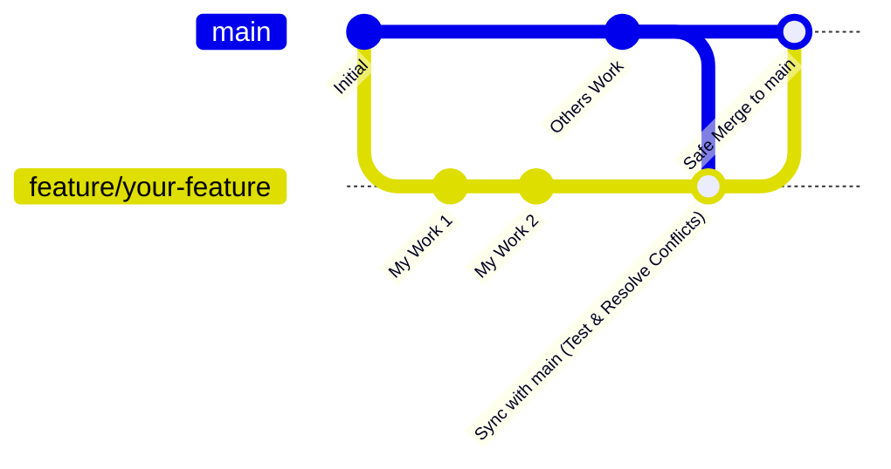

# Y-Flow

Hard Constraint Flow-Matching for Trajectory Prediction.

Exp-01은 2D Swiss roll **좌표점**에서 무제약 Flow Matching과 training-free 제약 방법을 같은 데이터·같은 $v_t^\theta$로 비교한다.

---

## 1. 프로젝트 핵심 목표 (Objectives)

* Hard constraint를 지키면서 Flow Matching 샘플을 생성한다.
* 데이터와 메타(`train.npy` / `eval.npy` / `meta.json`)를 한 세트로 고정해 training-free 비교가 같은 점을 쓰게 한다.

---

## 2. 환경 구축 및 빌드 방법 (Setup & Build)

```bash
conda env create -f environment.yml
conda activate yflow
```

`pytorch-cuda=12.4` (pytorch 채널). GPU 드라이버 CUDA 13.x와 호환.

---

## 3. 협업을 위한 Git 브랜치 전략 및 워크플로우

본 프로젝트는 여러 연구자와 개발자가 함께 협업하므로, 실수를 방지하고 메인 코드베이스의 안정성을 보존하기 위해 아래의 Git 워크플로우를 반드시 준수합니다.



### 세부 협업 단계 (Step-by-Step)

1. **새로운 기능 개발용 로컬 브랜치 생성**
    ```bash
    git checkout main
    git pull origin main
    git checkout -b feature/your-feature-name
    ```

2. **개별 작업 및 로컬 테스트**
    ```bash
    git add .
    git commit -m "feat: short description"
    python -m unittest discover -s test -v
    ```

3. **원격 최신 `main`을 작업 브랜치에 반영**
    ```bash
    git checkout main
    git pull origin main
    git checkout feature/your-feature-name
    git merge main
    ```

4. **충돌을 해결한 뒤 테스트가 통과하는지 확인한다.**

5. **검증된 브랜치를 `main`에 머지**
    ```bash
    git checkout main
    git merge feature/your-feature-name
    git push origin main
    ```

규칙: `docs/NOTICE.md`.

---

## 4. 실행

Swiss roll dump는 `datasets/swiss_roll/default/`에 있다. 없으면 첫 `train`이 만든다.

```bash
conda activate yflow

./run_exp_01_swiss_roll.sh
```

기본 `COMMAND=hardflow`, `RUN_NAME=exp_01_swiss_roll`. HardFlow는 training-free라 `runs/{run_name}/flowmatch/last.pt`가 있으면 학습을 건너뛴다. 없으면 FlowMatch를 먼저 학습한다.

```bash
COMMAND=flowmatch ./run_exp_01_swiss_roll.sh
COMMAND=hardflow RUN_NAME=exp1 ./run_exp_01_swiss_roll.sh
COMMAND=hardflow ./run_exp_01_swiss_roll.sh --device cuda --steps 20000
```

직접 호출:

```bash
python main.py flowmatch --mode train --run_name exp1
python main.py flowmatch --mode eval --run_name exp1
python main.py hardflow --mode train --run_name exp1
python main.py hardflow --mode eval --run_name exp1
python main.py all --mode eval --run_name exp1
```

커맨드: `all`, `flowmatch`, `hardflow`, `yflow`, `safeflow`, `uniconflow`, `guideflow`.  
`--mode train|eval`. yaml과 같은 키는 CLI로 override.

산출물:

* FlowMatch 체크포인트: `runs/{run_name}/flowmatch/last.pt` (HardFlow도 이 backbone)
* 방법별 지표: `runs/{run_name}/{command}/metrics.json`
* run 통합: `runs/{run_name}/metrics.json`

구현됨: `flowmatch` train/eval, `hardflow` train(skip 또는 FM 학습) / eval, `yflow` train(skip 또는 FM 학습) / eval. 나머지 command는 아직 `NotImplementedError`.

테스트:

```bash
python -m unittest discover -s test -v
```

---

## 5. 프로젝트 디렉토리 구조 및 파일 기능

```
Y-Flow/
├── main.py
├── run_exp_01_swiss_roll.sh
├── configs/exp_01_swiss_roll.yaml
├── datasets/swiss_roll/default/   # train.npy, eval.npy, meta.json
├── data/
├── model/
├── train/
├── sample/
├── constraints/
├── eval/
├── utils/
├── docs/
├── test/
└── runs/{run_name}/{command}/
```

* [Model](model/README.md)
* [Train](train/README.md)
* [Data](data/README.md)
* [configs](configs/README.md)
* [constraints](constraints/README.md)
* [Eval](eval/README.md)
* [Sample](sample/README.md)
* [utils](utils/README.md)
* [viz](viz/README.md)
* [Docs](docs/README.md)
* [Test](test/README.md)
