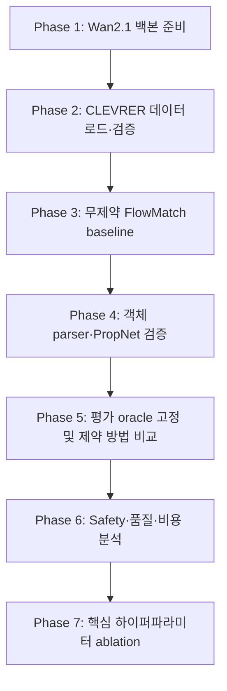

# Exp-02. Wan2.1 기반 Hard-Constraint 비디오 생성 실험 계획

비교 방법:

- **FlowMatch** (무제약 baseline. 사전학습 동결 Wan2.1 $v_t^\theta$)
- **YFlow** (Physical Guidance Warm Start + Terminal PGD + 선형 보간)

Exp-02 비교에는 FlowMatch와 YFlow만 포함한다. HardFlow, SafeFlow, UniConFlow, GuideFlow는 이 실험에서 제외한다.

선행 실험: Wan 픽셀 생성 전에 주석 공간 인식을 먼저 둔다. [`exp_02_sub_video_recognition.md`](exp_02_sub_video_recognition.md).

목적: 사전학습된 Flow Matching 비디오 파운데이션 모델인 **Wan2.1**을 동결(frozen) 백본으로 채택하여,  
비디오를 밑바닥부터 대규모로 학습하지 않고 **training-free** 방식으로 제약 조건을 강제할 때,  
무제약 Flow Matching 대비 YFlow가 **동일한 비디오 hard constraint 규칙을 실제로 만족하는지**,
그리고 비디오 품질(FVD, CLIP)과 연산 효율성(초/비디오, VRAM)의 Pareto Frontier를 체계적으로 검증한다.

---

## 1. 실험 목적 및 연구 가설

### 1.1 연구 배경 및 동기

1. **비디오 생성에서 Hard Constraint의 필요성**:
   - 최근 Wan2.1, CogVideoX, HunyuanVideo 등 Flow Matching(Rectified Flow) 기반 대형 비디오 모델들은 사실적인 동역학을 생성하지만, **본질적인 환각(hallucination)과 물리 법칙 위반** 문제를 내포한다.
   - **첫 프레임/키프레임 일탈 (Keyframe Drift)**: Image-to-Video(I2V)나 시점 보간에서 생성 비디오의 첫 프레임이 원본 조건 이미지 $I_0$에서 미세하게 벗어나 정체성(identity)이 손상됨.
   - **공간 궤적/바운딩 박스 이탈 (Spatial Trajectory Violation)**: 객체가 지정된 이동 허용 구역(ROI)을 벗어나거나, 화면 내 금지 구역(장애물, 안전 영역)을 침범함.
   - **시간적 가속도/지터링 폭증 (Temporal Kinematic & Flicker Violation)**: 인접 프레임 간 과도한 급가속, 프레임 깜빡임(flicker), 순간이동 등 물리적으로 불가능한 불연속 궤적 발생.
   - **디스플레이 동적 범위 위반 (Dynamic Range Violation)**: 잠재 공간(latent space) 이상치로 인한 디코딩 픽셀 포화 및 색상 왜곡(burn-in artifacts).

2. **비디오를 처음부터 학습시키지 않는 이유 (Wan2.1 채택)**:
   - 비디오 생성 모델을 처음부터 학습(scratch training)하려면 수천~수만 시간의 고비용 클러스터 연산과 테라바이트급 비디오 데이터셋이 필요하다.
   - **Wan2.1**은 Flow Matching(Linear CFM / Rectified Flow) 패러다임을 사용하는 최신 오픈소스 비디오 파운데이션 모델로서, 3D Causal VAE 잠재 공간에서 잘 학습된 속도장 $v_t^\theta(z_t, t, c)$을 제공한다.
   - 따라서 백본 가중치를 완전히 동결(frozen)하고, `eval/` 단에서 **training-free** 방식으로 속도장과 궤적을 제어함으로써 모델 본래의 풍부한 생성 능력을 보존하면서 제약 만족 여부를 공정하게 비교할 수 있다.

3. **핵심 연구 가설**:
   - 본 실험은 FlowMatch와 Y-Flow 두 방법만 비교하며, 가설은 다음과 같다:
     - 예측된 종단 잠재 텐서 $\hat{z}_1^{\text{raw}}$에만 제약을 걸어 GPU 배치 PGD로 최적화하고,
     - **선형 보간 ($\eta = \Delta t / (1-t)$)**을 통해 자연스럽게 전진하므로 역맵 평가나 추가 DiT forward가 전혀 필요 없으며,
     - 국소 립시츠 게이팅을 통해 초반 노이즈 구간의 왜곡을 방지하여 **비디오 생성 품질(FVD/CLIP)을 보존하면서도 100% 제약 준수**를 달성할 것이다.

---

## 2. 생성 대상 및 좌표계 분리 원칙 (`data/NOTICE.md` 준수)

비디오 생성 태스크에서는 물리 공간과 모델 추론 공간이 서로 다른 차원과 스케일을 갖는다.  
`data/NOTICE.md`의 **좌표계 분리 원칙**을 엄격히 준수하여 제약과 속도장을 정의한다.

| 구분 | 공간 (Space) | 표현 및 차원 | 역할 및 규칙 |
| :--- | :--- | :--- | :--- |
| **물리 공간** | Physical Video Space ($V \in \mathbb{R}^{B \times 3 \times T \times H \times W}$) | RGB 픽셀 값 ($V_{c,t,y,x} \in [-1, 1]$ 또는 $[0, 1]$), 물리적 바운딩 박스 좌표, 광학 흐름(optical flow) | **모든 제약 오라클 $h(V)$와 비용 $C(V)$, 평가 지표는 물리 비디오 공간에서 정의된다.** |
| **잠재 공간** | Latent Space ($z \in \mathbb{R}^{B \times C_{\text{lat}} \times T' \times H' \times W'}$) | Wan2.1 3D Causal VAE 잠재 표현 ($C_{\text{lat}}=16$, $T' = \lfloor (T-1)/4 \rfloor + 1$, $H' = H/8$, $W' = W/8$) | Wan2.1 DiT 속도장 $v_t^\theta(z_t, t, c)$이 학습되고 ODE 적분이 수행되는 영평균·단위분산 공간 |

### 2.1 3D Causal VAE 매핑

$${
V = \mathcal{D}_{\text{VAE}}(z), \qquad z = \mathcal{E}_{\text{VAE}}(V)
}$$

- **인과적(Causal) 시공간 구조**:
  - Wan2.1의 3D VAE는 시간 축에 대해 인과적(causal) 합성곱을 사용하므로, 첫 번째 잠재 프레임 $z[:, :, 0, :, :]$은 정확히 비디오의 첫 번째 픽셀 프레임 $V[:, :, 0, :, :]$에 직접 대응된다.
- **최적화 미분 경로**:
  - PGD 터미널 최적화 단계에서 $h(V)$의 기울기 $\nabla_z C(\mathcal{D}_{\text{VAE}}(z))$는 VAE 디코더를 통한 Autograd 역전파로 계산하거나,
  - 추론 속도 극대화를 위해 잠재 공간 직접 대리 제약(Latent-Space Surrogate Constraint $\tilde{h}(z) \le 0$)을 적용할 수 있다.

---


### 2.2 CLEVRER 기반 생성 태스크와 입출력 초안

**확정 사항**은 CLEVRER 우선 사용이다. 아래는 현재 `Wan2.1-T2V-1.3B` 백본을 유지하는 입출력 설계안이며, 아직 구현된 API를 뜻하지 않는다.

첫 단계의 태스크는 **초기 장면과 텍스트 설명, 물리 제약을 조건으로 짧은 비디오를 생성**하는 것이다. 단일 첫 프레임만으로 초기 속도와 유일한 미래를 알 수 없으므로, 원본 미래 영상의 정확한 재현을 기본 성공 조건으로 삼지 않는다.

#### A. 평가 시나리오 한 개의 입력

| 필드 | 형태 | 사용처 |
| :--- | :--- | :--- |
| `scenario_id`, `source_video`, `split`, `clip_start` | 식별자 및 원본 구간 | 재현성 및 데이터 추적 |
| `prompt`, `negative_prompt` | 문자열 | tokenizer와 text encoder를 거쳐 Wan에 입력 |
| `initial_frame` | RGB `[3, H, W]`, `[-1, 1]` | 첫 프레임 제약의 기준 이미지 $I_0$ |
| `objects_initial` | 객체 ID, 속성, 시작 시점 가시성 및 좌표 메타데이터 | 객체 대응과 초기 상태 평가; 좌표계 명시 |
| `constraint_spec` | 활성 제약 이름, 허용 오차, 적용 객체·시간 구간, 좌표계 | 각 방법의 제약 오라클과 sampler |
| `seed`, `initial_noise` | 시드 및 공통 잠재 노이즈 $z_0$ | 모든 비교 방법이 동일한 노이즈 사용 |
| `frame_times`, `spatial_transform`, `valid_region` | 시간 매핑, 영상 변환, 유효 영상 영역 | 영상과 주석의 정렬 및 padding 제외 |
| `reference_video`, `reference_states`, `reference_collisions` | 원본 클립 및 정답 주석 | 기본 모드에서는 평가 전용 |

기본 프롬프트는 초기 장면의 객체 속성과 고정 카메라·장면 스타일을 서술한다. 움직임 설명을 추가하면 그 정보의 출처를 기록한다. 초기 속도를 조건으로 줄 경우 `initial_state_conditioned` 모드로 명시하며, 첫 프레임만 사용하는 모드와 구분한다.

미래 정답 궤적·충돌 시각을 생성 중 제약으로 사용할 경우 별도 `trajectory_controlled` 모드로 기록한다. 이 경우 미래 주석은 명시적인 제어 입력이며, 미래 예측 성능으로 해석하지 않는다. 기본 모드에서는 sampler가 평가 전용 미래 주석에 접근하지 않는다.

#### B. Wan과 sampler 사이의 계약

현재 T2V 체크포인트에서 DiT가 받는 것은 **잠재 비디오, 모델 시간, 텍스트 임베딩**이다. $I_0$와 `constraint_spec`은 외부 sampler가 사용한다. T2V에 이미지를 직접 넣는 native I2V 인터페이스로 표현하지 않는다. Native I2V를 선택하면 백본과 전체 비교 조건을 함께 변경해야 한다. [Diffusers Wan 공식 문서](https://huggingface.co/docs/diffusers/api/pipelines/wan)

```text
prompt -> tokenizer + text encoder -> text embeddings
z_i + model timestep + text embeddings -> frozen Wan DiT -> flow prediction
flow prediction -> time/sign adapter -> v_i
z_i + (1-t_i) * v_i -> predicted terminal latent
terminal latent -> differentiable VAE decode -> predicted video -> h, C
constraint sampler -> corrected latent z_(i+1)
final latent -> VAE decode -> generated video
```

- **현재 규격의 잠재 입력/속도 출력**: `[B, 16, 9, 60, 104]`. 초기 실행은 `B=1`.
- **텍스트 조건**: `[B, L, text_dim]`. tokenizer 길이·padding과 차원은 해당 체크포인트 설정을 따른다. CFG의 negative branch도 실제 텍스트 인코더 출력을 사용한다.
- **시간 좌표**: 프로젝트는 noise-to-data $t:0\to1$을 사용한다. Wan의 noise level $\sigma$와 $t=1-\sigma$로 대응하는 Euler 구성에서는 모델 시간과 속도 부호를 변환하고, shifted scheduler의 실제 격자에서 $\Delta t$를 계산한다. `t * 1000`과 DiT 출력을 그대로 쓰는 방식은 기준 파이프라인과 동치 검증이 필요하다.
- **VAE**: 체크포인트의 latent mean/std 변환을 적용한다. 제약 최적화에서는 VAE 가중치를 동결하되 입력 latent에 대한 gradient는 유지한다. 시각화 전용 decode와 미분 가능한 decode를 구분한다.
- **FlowMatch baseline**: 같은 텍스트 조건·노이즈·시간 격자를 사용하며 $h$는 평가에만 쓴다. 따라서 첫 프레임 이미지를 제약으로 사용하는 방법들과 비교한 수치는 제약 주입 효과이며, native I2V baseline 대비 성능을 뜻하지 않는다.

텍스트 CFG, scheduler 갱신 및 latent 정규화의 기준 구현은 [Diffusers WanPipeline](https://github.com/huggingface/diffusers/blob/main/src/diffusers/pipelines/wan/pipeline_wan.py)을 따른다. 사용 버전과 scheduler 설정을 실행 기록에 저장한다.

#### C. 최종 출력과 평가 산출물

| 출력 | 형태 | 의미 |
| :--- | :--- | :--- |
| `final_latent` | `[B, 16, 9, 60, 104]` | 적분 종료 후 모델 잠재 표현 |
| `video_raw` | float `[B, 3, 33, 480, 832]` | VAE decode 직후, 표시용 clamp·첫 프레임 교체 전 영상 |
| `video_final` | float, 위와 동일 | 해당 방법의 terminal correction까지 포함한 최종 결과 |
| `video.mp4` | 33프레임, 16fps | 시각적 확인용 인코딩 결과 |
| `generated_tracks` | 객체별 프레임 좌표, 속성, 가시성·신뢰도 | 생성 영상에서 별도 추출한 추정치; Wan 직접 출력이 아님 |
| `metrics` | JSON | 제약별 위반, 오라클 실패, 품질, 시간, VRAM, DiT 호출 수 |
| `manifest` | JSON | 시나리오, 모델·코드 버전, 프롬프트, 노이즈, 전처리, 활성 제약 및 sampler 설정 |

물리 지표는 MP4 압축 전 float 결과에서 계산한다. terminal correction의 효과를 알 수 있도록 보정 전후 지표를 함께 기록한다. 객체를 찾지 못한 결과는 안전한 것으로 집계하지 않고 실패 상태를 기록한다. 3D 상태를 판정할 오라클이 없으면 영상의 2D 관측 지표로 명시하며 3D 비관통 보장을 주장하지 않는다.

#### D. CLEVRER 전처리와 첫 실행 범위

- 공개 정답 주석이 있는 validation split에서 고정된 클립 100개를 평가용으로 구성하는 안을 사용한다. 임계값·오라클 조정은 별도 train 개발 클립에서 수행한다. [CLEVRER 공식 README](https://data.csail.mit.edu/clevrer/README.txt)
- 기존 생성 규격 `33 frames / 16 fps / H=480 / W=832`를 우선 유지한다. 프레임 시각은 $s_k=s_0+k/16$이며 첫 프레임에서 마지막 프레임까지 2초다. 원본 영상의 timestamp에 맞춰 프레임과 주석을 정렬하고 선택된 원본 인덱스를 저장한다. 원본 전체를 33프레임으로 단순 축약해 시간축을 바꾸지 않는다.
- CLEVRER 원본 비율을 유지해 resize하고 좌우 padding한다. 원본 `W=480, H=320`이라면 유효 영역은 `W=720, H=480`, 좌우 padding은 각각 56픽셀이다. 픽셀 제약은 유효 영역의 원소 수로 정규화하고, 품질 평가에는 동일한 유효 영역 crop을 적용한다.
- 위치의 3D world 좌표와 2D image 좌표를 별도 필드로 보존한다. world 좌표를 영상 크기로 나누어 2D 궤적으로 사용하지 않는다. 이미지 좌표는 카메라 투영 또는 검증된 parser로 얻는다.
- 먼저 텍스트 조건의 무제약 생성과 첫 프레임 제약의 입출력을 검증한다. 객체 추적·접촉 오라클을 검증한 후 물리 제약을 추가한다. CLEVRER의 정상적인 진입·퇴장을 허용하고, 충돌을 포함한 모든 프레임에 동일한 저가속도 조건을 강제하지 않는다.

현재 `model/wan.py`는 DiT+VAE 래퍼 단계다. text encoder 연동, 시간·부호 변환, VAE latent 정규화, 미분 가능한 decode 및 CLEVRER 데이터/평가 경로를 보완해야 위 계약을 실행할 수 있다.

---

## 3. 데이터셋 담당 범위 및 도메인별 제약 매핑 (`DataBundle` 규격)

동일한 초기 조건과 제약 조건을 전 방법론이 일관되게 공유하기 위해 `DataBundle`로 묶어 고정한다.  
Wan2.1 기반 Hard-Constraint 비디오 생성 실험의 목적(물리적 안전성, 궤적 보존, 깜빡임 방지)에 부합하는 **4가지 유력 데이터셋 후보군**과 적용 가능한 구체적 제약을 다음과 같이 정리한다.

현재 담당 실험은 **후보 4: Physics-101 / CLEVRER**를 대상으로 한다. 후보 1~3은 동료가 담당한다. 아래의 다른 도메인 설명은 공동 비교를 위한 참고이며, 현재 작업의 데이터 구축·제약 설계·평가는 후보 4에 집중한다. **CLEVRER를 우선 실행**하고 Physics-101은 후속 실험으로 둔다. 사용할 split과 클립 목록은 아래 입출력 초안을 기준으로 확정한다.

### 3.1 비디오 제약 벤치마크 데이터셋과 담당 범위

1. **후보 1: BridgeData V2 / RoboSet (로봇 조작 및 체화 AI 비디오) — [동료 담당]**
   - **특징**: 고정 카메라 시점에서 로봇 팔(WidowX, Franka)이 싱크대/테이블 위의 물체를 집고 이동하거나 장애물을 회피하는 비디오 데이터셋.
   - **선정 이유**:
     - 로봇 궤적 제어는 제약 생성(Constrained Generation) 연구의 가장 정통적이고 엄밀한 응용 분야.
     - **고정 카메라 환경**: 배경 불변성($h_{\text{bg}}$) 가정이 성립하여 객체와 엔드이펙터의 궤적만 독립적으로 평가 가능.
     - **물리적 경계면이 명확함**: 테이블 표면, 장애물 컨테이너, 그리퍼 개폐 위치 등 Ground-Truth 2D/3D 좌표가 확실함.
   - **적용할 제약 ($h \le 0$)**:
     - ${h_{\text{first}}(V)}$: 초기 씬 이미지 $I_0$ 완벽 보존 (작업 시작 상태).
     - ${h_{\text{table}}(V)}$: 테이블 표면 침범 금지 (그리퍼/물체가 테이블 면 아래로 관통하는 환각 차단).
     - ${h_{\text{obs}}(V)}$: 테이블 위 금지 구역(장애물 $\mathcal{O}_{\text{obs}}$) 침범 방지 (충돌 회피).
     - ${h_{\text{acc}}(V)}$: 로봇 엔드이펙터 및 물체의 물리적 최대 가속도 상한 (순간이동/급가속 차단).

2. **후보 2: VBench-Trajectory / MotionCtrl (일반 객체 궤적 제어 벤치마크) — [동료 담당]**
   - **특징**: 텍스트 프롬프트와 함께 객체의 2D 시공간 이동 궤적(Waypoint 및 Bounding Box 경로)이 레이블된 공개 벤치마크.
   - **선정 이유**:
     - Wan2.1(T2V)의 원래 사전학습 도메인(자연스러운 실사 비디오)과 100% 일치하여 모델의 표현력을 온전히 활용 가능.
     - 무제약 FlowMatch가 흔히 일으키는 **"프롬프트 무시 및 궤적 이탈"**을 정량적으로 입증하기에 가장 용이함.
     - CoTracker / Grounding DINO 등 검증된 객체 추적기를 통해 사후 오라클 평가를 100% 자동화 가능.
   - **적용할 제약 ($h \le 0$)**:
     - ${h_{\text{first}}(V)}$: 첫 프레임 조건 완벽 일치.
     - ${h_{\text{bbox}}(V)}$: 핵심 객체 중심 좌표가 허용 튜브 반경 $\tau_{\text{box}}$ 내에 유지.
     - ${h_{\text{bg}}(V)}$: 전경 객체 마스크 외곽 배경 영역의 픽셀 변화량 제한.
     - ${h_{\text{acc}}(V)}$: 프레임 간 모션 가속도 및 고주파 지터링 억제.

3. **후보 3: NuScenes-QA / Waymo Open (자율주행 도로 주행 비디오) — [동료 담당]**
   - **특징**: 차량 전방 카메라에서 취득된 차선, 주변 차량, 보행자, 주행 가능 영역(Drivable Area)이 주어지는 주행 비디오.
   - **선정 이유**:
     - SafeFlow(CBF-QP)와 GuideFlow(CVF/RFE) 원논문이 핵심 벤치마크로 삼은 자율주행 안전 도메인.
     - 차선 이탈 방지, 충돌 방지 등 실제 산업적 안전 요구사항과 직결됨.
   - **적용할 제약 ($h \le 0$)**:
     - ${h_{\text{drivable}}(V)}$: 주행 차량이 도로 차선(drivable lane) 바깥으로 이탈하지 않음.
     - ${h_{\text{safe\_dist}}(V)}$: 전방 선행 차량 및 보행자와의 안전 차간 거리 유지.
     - ${h_{\text{acc}}(V)}$: 차량의 급격한 물리적 조향/제동 가속도 한계 준수.

4. **후보 4: Physics-101 / CLEVRER (물리 인과 비디오) — [현재 담당 실험으로 채택]**
   - **특징**: CLEVRER는 도형 객체 충돌을 렌더링한 synthetic video이고, Physics-101은 실제 물체를 촬영한 실험 영상이다. 현재는 CLEVRER를 먼저 사용하며 Physics-101은 후속이다.
   - **선정 이유**:
     - 에너지 보존, 운동량 보존, 반발 계수 등 수학적 물리 법칙을 $h(V)$로 직접 수식화하기 쉬움.
     - Swiss Roll의 toy 성격을 비디오로 점진 확장하는 연구 중간 단계로 적합.
   - **적용할 제약 ($h \le 0$)**:
     - ${h_{\text{bound}}(V)}$: 상자/당구대 경계면 외부 이탈 금지.
     - ${h_{\text{contact}}(V)}$: 물체 간 관통(Penetration) 금지.

---

### 3.2 데이터셋별 특성 및 Hard Constraint 대응표

| 데이터셋 | 도메인 | 주요 제약 $h_1$ (경계/초기조건) | 주요 제약 $h_2$ (공간/영역) | 주요 제약 $h_3$ (시간/운동학) | 주요 제약 $h_4$ (값 범위) | 담당 범위 |
| :--- | :--- | :--- | :--- | :--- | :--- | :---: |
| **BridgeData V2** | 로봇 팔 조작 | 첫 씬 프레임 일치 (${h_{\text{first}}}$) | 테이블 관통 금지 (${h_{\text{table}}}$) & 장애물 회피 (${h_{\text{obs}}}$) | 그리퍼 최대 가속도 제한 (${h_{\text{acc}}}$) | 픽셀 포화 방지 (${h_{\text{range}}}$) | 동료 담당 |
| **VBench Trajectory** | 일반 객체 궤적 | 첫 프레임 일치 (${h_{\text{first}}}$) | 지정 튜브 궤적 유지 (${h_{\text{bbox}}}$) & 배경 고정 (${h_{\text{bg}}}$) | 프레임 간 지터링 억제 (${h_{\text{smooth}}}$) | 픽셀 포화 방지 (${h_{\text{range}}}$) | 동료 담당 |
| **NuScenes** | 자율주행 도로 | 주행 시작 씬 일치 (${h_{\text{first}}}$) | 차선 이탈 방지 (${h_{\text{lane}}}$) & 차간 거리 유지 (${h_{\text{col}}}$) | 급제동/급조향 가속도 상한 (${h_{\text{acc}}}$) | 픽셀 포화 방지 (${h_{\text{range}}}$) | 동료 담당 |
| **CLEVRER** | 물리 강체 충돌 | 초기 배치 일치 (${h_{\text{first}}}$) | 물체 간 상호 관통 금지 (${h_{\text{penetrate}}}$) | 질량/속도 불연속 점프 금지 (${h_{\text{kinematic}}}$) | 픽셀 포화 방지 (${h_{\text{range}}}$) | **현재 담당** |

---

### 3.3 현재 담당 벤치마크: CLEVRER 우선, Physics-101 후속

현재 실험은 **CLEVRER를 우선 데이터셋으로 채택**한다. Physics-101은 실제 촬영 영상으로 확장하는 후속 데이터셋이다. 로봇 조작, 일반 객체 궤적, 자율주행 데이터는 동료가 담당한다.

- **실험 초점**: 초기 상태 보존, 물체 간 관통 방지, 관측 가능한 경계 준수, 충돌 전후 운동의 일관성을 평가한다.
- **데이터 확정 항목**: CLEVRER 주석과 좌표계를 확인한 뒤 사용할 split, 클립 구간, 객체 상태 추출 방식, 제약 임계값을 고정한다. Physics-101 확장 시 결과를 별도 실험으로 기록한다.
- **제약 설계**: 경계·접촉 제약은 해당 장면과 주석으로 판정 가능한 경우에 적용한다. 화면상 객체 겹침만으로 3D 관통을 판정하지 않는다. 충돌 구간을 고려해 운동학 제약을 정의하며, §4의 픽셀 시간 차분 지표와 객체의 물리적 가속도를 구분한다.
- **YFlow 연산자**: 객체 상태의 보정이 생성 비디오에 어떻게 반영되는지 정의한 뒤 $P$ warm start를 평가한다. 이 매핑이 준비되기 전에는 $\mu=0$ 설정을 사용할 수 있다.
- **프로토콜 상태**: §4~§8은 공통 비교 초안이다. 후보 4의 최종 제약 집합과 Safety 집계 항목은 데이터 및 오라클 확인 후 함께 확정한다.

---

### 3.4 기록할 벤치마크 규격 및 메타데이터 (`meta.json`)

- **표준 평가 규격 (Benchmark Setup)**:
  - **기본 모델**: `Wan2.1-T2V-1.3B` (RTX 3090 24GB 전량 적재)
  - **프레임 수 ($T$)**: $33$ 프레임 (약 2초 분량, 16 fps)
  - **해상도 ($H \times W$)**: $480 \times 832$
  - **잠재 해상도 ($T' \times H' \times W'$)**: $9 \times 60 \times 104$
  - **평가 시나리오 수 ($N_{\text{eval}}$)**: $100$개 (고정된 초기 노이즈 $z_0$ 시드)

| 키 | 기본값 | 의미 |
| :--- | :--- | :--- |
| `model_name` | `Wan2.1-T2V-1.3B` | 기본 백본 모델 식별자 |
| `dataset_name` | `clevrer` | 우선 실험 데이터셋 |
| `n_frames` ($T$) | 33 | 생성 비디오 프레임 수 |
| `height`, `width` | 480, 832 | 생성 비디오 공간 해상도 |
| `fps` | 16 | 재생 프레임률 |
| `n_eval` | 100 | 평가 시나리오 개수 |
| `n_steps` ($N$) | 30 | ODE 적분 스텝 수 (Flow Matching) |
| `eps_first` | 0.02 | 첫 프레임 최대 허용 픽셀 MSE |
| `tau_box` / `tau_table` | 0.05 | 공간 궤적 및 테이블 경계 허용 오차 |
| `tau_acc` | 0.10 | 인접 프레임 간 최대 허용 가속도 노름 |
| `t_on` | 0.5 | 제약 활성화 시작 시각 |
| `seed` | 42 | 재현성을 위한 초기 가우시안 잠재 노이즈 $z_0$ 시드 |

---

## 4. 통일된 Video Hard Constraint 정의

FlowMatch와 YFlow는 아래의 **동일한 제약 함수 집합**을 평가 오라클로 공유한다.
좌표 $V \in [-1, 1]^{3 \times T \times H \times W}$에 대해 성분별 $h_j(V) \le 0$을 만족해야 한다.

### 4.1 제약 부등식 $h(V) \le 0$

1. **초기 프레임/키프레임 제약 ($h_{\text{first}}$)**:
   생성된 비디오의 첫 프레임 $V_0$는 조건 이미지 $I_0$와 일치해야 한다:
   $${
   h_{\text{first}}(V) = \frac{1}{3 H W} \|V_0 - I_0\|_2^2 - \epsilon_{\text{first}} \le 0
   }$$
   (또는 $L_\infty$ 규격: $\|V_0 - I_0\|_\infty - \epsilon_{\infty} \le 0$)

2. **공간 궤적 및 바운딩 박스 제약 ($h_{\text{bbox}}$)**:
   시간 $t$에 대해 객체의 검출/트래킹 중심 좌표 $p_{\text{obj}}(t) \in [0, 1]^2$가 시공간 허용 상자 $\mathcal{B}(t) = [x_{\min}(t), y_{\min}(t), x_{\max}(t), y_{\max}(t)]$ 내부에 머물러야 한다:
   $${
   h_{\text{bbox}}(V) = \max_{t \in [0, T-1]} \left( d(p_{\text{obj}}(t), \mathcal{B}(t)) \right) - \tau_{\text{box}} \le 0
   }$$
   배경 불변 영역(Static Background ROI)에 대해서는 전경 마스크 $M_{\text{fg}}(t)$ 바깥의 변화량을 제한한다:
   $${
   h_{\text{bg}}(V) = \max_{t \in [0, T-1]} \frac{1}{|1 - M_{\text{fg}}(t)|} \| (1 - M_{\text{fg}}(t)) \odot (V_t - V_0) \|_1 - \tau_{\text{bg}} \le 0
   }$$

3. **시간적 운동학 및 깜빡임 방지 제약 ($h_{\text{acc}}$)**:
   프레임 간 과도한 가속도(급격한 모션 튐, 깜빡임, 물리적 순간이동)를 억제하기 위해 2계 시간 차분(가속도)의 최대 노름을 제한한다:
   $${
   h_{\text{acc}}(V) = \max_{1 \le t \le T-2} \frac{1}{3 H W} \|V_{t+1} - 2 V_t + V_{t-1}\|_2 - \tau_{\text{acc}} \le 0
   }$$

4. **픽셀 유효 동적 범위 제약 ($h_{\text{range}}$)**:
   디코딩된 비디오 픽셀이 표시 장치 유효 범위 $[-1, 1]$ 내에 완전히 존재해야 한다:
   $${
   h_{\text{range}}(V) = \max \left( \max(V - 1.0), \max(-1.0 - V) \right) \le 0
   }$$

### 4.2 제약 위반 비용 함수 $C(V)$ (`cost`)

YFlow 최적화에 사용되는 단일 스칼라 비용 함수:
$${
C(V) = \frac{1}{2} w_{\text{first}} \max(0, h_{\text{first}}(V))^2 + \frac{1}{2} w_{\text{bbox}} \max(0, h_{\text{bbox}}(V))^2 + \frac{1}{2} w_{\text{acc}} \max(0, h_{\text{acc}}(V))^2 + \frac{1}{2} w_{\text{range}} \max(0, h_{\text{range}}(V))^2
}$$
- $V \in \mathcal{C}$이면 $C(V) = 0$이며, 경계면에서 $C^1$ 연속으로 부드럽게 수렴하여 최적화 시 진동을 방지한다.

### 4.3 물리적 연산자 $P(V)$ (`project_physical`)

- **정의**:
  비디오 도메인에서 이상적인 물리적/기하학적 상태로 사영하는 연산자:
  1. 첫 프레임을 정답 이미지로 직접 치환: $P(V)_0 = I_0$
  2. 배경 마스크 바깥 픽셀을 $I_0$의 배경으로 클램핑: $P(V)_t \odot (1 - M) = I_0 \odot (1 - M)$
  3. 시간 축 Gaussian/Savitzky-Golay 스무딩 필터 적용으로 가속도 완화.
- **$\mu = 0$ 설정 지원 (`docs/YFlow.md` 4.3.1절)**:
  - 고해상도 비디오 매니폴드에서 엄밀한 물리 연산자 $P(V)$를 구성하기 어려운 일반 Text-to-Video 시나리오의 경우, $\mu = 0$으로 설정하여 물리 warm-start 항을 끈 terminal optimization ablation을 수행한다:
  $${
  \hat{z}_1^* = \arg\min_{\hat{z}_1} C(\mathcal{D}(\hat{z}_1)) + \frac{\lambda}{2} \|\hat{z}_1 - \hat{z}_1^{\text{raw}}\|_2^2 \quad \text{s.t.} \quad h(\mathcal{D}(\hat{z}_1)) \le 0
  }$$

### 4.4 실행 가능 투영 `project_feasible(V, buffer)`

터미널 최종 스텝에서 미세 잔여 위반을 즉각 보정:
- 픽셀 클램핑: $V \leftarrow \text{clip}(V, -1.0 + \text{buffer}, 1.0 - \text{buffer})$
- 첫 프레임 엄밀 대체: $V_0 \leftarrow I_0$
- 배경 영역 하드 마스킹 투영.

---

## 5. FlowMatch와 YFlow의 비디오 확장 매핑

모든 방법은 **동일한 사전학습 동결 Wan2.1 DiT 백본** $v_t^\theta(z_t, t, c)$과 동일한 초기 노이즈 $z_0 \sim \mathcal{N}(0, I)$를 사용한다.

| 방법 | 유형 | 비디오 도메인 적응 방식 | 예상 특성 및 한계점 |
| :--- | :---: | :--- | :--- |
| **FlowMatch** | Unconstrained | Wan2.1 순수 Euler ODE 적분. 제약 전혀 개입 없음 ($h$는 평가에만 사용). | 생성 비디오 품질은 최상이지만, 첫 프레임 드리프트, 객체 탈출, 깜빡임 등 제약 위반율 높음. |
| **YFlow (Ours)** | Training-free | 예측 종단 $\hat{z}_1^{\text{raw}}$에 $P$ warm start 후 GPU-batched Autograd PGD 최적화 $\to$ **선형 보간 ($\eta = \Delta t / (1-t)$)**으로 전진. | 역맵/추가 DiT forward 불필요. 립시츠 게이팅으로 초반 안정성 보장. 최고 수준의 비디오 품질(FVD)과 100% 제약 준수, 실시간성 동시 달성. |

---

## 6. 평가 지표 및 벤치마크 설계

### 6.1 제약 만족도 평가 (Constraint Metrics)

- **Total Safety Rate (종합 안전율, $\uparrow$)**:
  모든 테스트 비디오 중 4개 제약($h_{\text{first}}, h_{\text{bbox}}, h_{\text{acc}}, h_{\text{range}} \le 0$)을 100% 동시에 만족한 비디오의 비율.
- **제약별 위반율 및 평균 위반량 ($\downarrow$)**:
  - `first_frame_viol_rate` & `first_frame_mse`: 첫 프레임 일탈율 및 MSE.
  - `bbox_viol_rate` & `bbox_viol_mean`: 바운딩 박스 이탈율 및 평균 이탈 거리.
  - `temporal_acc_viol_rate` & `temporal_acc_mean`: 가속도 상한 초과율 및 평균 초과량.
  - `pixel_range_viol_rate`: 픽셀 클리핑/포화 위반율.

### 6.2 비디오 품질 및 정렬도 평가 (Visual Quality Metrics)

- **FVD (Fréchet Video Distance, $\downarrow$)**:
  I3D 기반 비디오 특징 분포 간 거리. (데이터 원본 동역학 보존도 측정).
- **Frame-wise FID (Fréchet Inception Distance, $\downarrow$)**:
  프레임 단위 이미지 시각 품질 및 선명도.
- **CLIP Similarity / Alignment ($\uparrow$)**:
  텍스트 프롬프트와 생성 비디오 프레임 간의 의미적 일치도.
- **Temporal Warping Error / Consistency ($\downarrow$)**:
  사전학습된 광학 흐름(RAFT 등)으로 인접 프레임을 워핑했을 때의 재구성 오차 (깜빡임 및 변형 정량화).

### 6.3 시스템 및 연산 효율성 평가 (System Efficiency)

- **Latency (초/비디오, $\downarrow$)**: 33 프레임 비디오 1편을 생성하는 총 소요 시간.
- **Peak VRAM (GB, $\downarrow$)**: 추론 중 최대 GPU 메모리 점유량.
- **NFE (Number of Function Evaluations, $\downarrow$)**: 백본 DiT 신경망 평가 횟수.

---

## 7. 단계별 실험 프로토콜 (Execution Protocol)



### 단계별 상세 계획

1. **Phase 1: Wan2.1 파이프라인 및 백본 연동**
   - Hugging Face / ModelScope의 `Wan2.1-T2V-1.3B` 및 3D Causal VAE 체크포인트 연동.
   - 단일 GPU 환경(RTX 3090 / 4090 / A100 등)에서 VRAM 8~16GB 내외로 동작 가능하도록 CPU 오프로딩 및 fp16/bf16 정밀도 설정.
   - Flow Matching 속도장 인터페이스 $v_t^\theta(z_t, t, c)$ 표준화.

2. **Phase 2: CLEVRER 데이터 준비 및 로딩 검증** — 완료 (2026-09-12)
   - `scripts/setup_clevrer.py`로 공식 validation 영상·주석을 받아 `datasets/clevrer/`에 저장했다.
   - `data.clevrer.CLEVRERDataset`의 시간 인덱스·world 좌표 주석 보존·letterbox·manifest 대응을 실제 데이터 샘플에서 검증했다.
   - 고정 eval 100 clip은 `datasets/clevrer/manifests/eval_100.json`. 전체 split은 `manifests/validation.json`.
   - **완료 게이트**: 원본 영상과 주석을 같이 로드하고, 원본 프레임 시각/ID 및 annotation scene ID가 일치한다. `test.test_clevrer` 9/9 통과.

3. **Phase 3: 무제약 FlowMatch Baseline 실행 및 제약 위반 패턴 분석**
   - 검증한 고정 prompt·noise·seed로 순수 Wan2.1 생성 및 품질/FVD/CLIP 측정.
   - parser가 검증되기 전의 객체 궤적·충돌·물리 제약 위반은 계산 불가로 표시하고 점수에서 생략한다.

4. **Phase 4: 객체 parser 및 PropNet 검증**
   - §7.1의 artifact 확인, 원본 validation 측정, Wan FlowMatch 출력 domain-shift 점검을 완료한다.
   - 모델·threshold·판정 불가 처리 및 2D/3D 주장 범위를 고정한다.

5. **Phase 5: FlowMatch와 YFlow 비교 추론 실행**
   - 동일한 초기 가우시안 잠재 $z_0$ 시드 및 동일한 DiT 백본 고정.
   - Y-Flow: $\hat{z}_1^{\text{raw}}$ 계산 $\to$ PGD 최적화 $\to$ 선형 보간 전진.

6. **Phase 6: 정량 분석 및 비교표 도출**
   - Safety Rate, FVD, CLIP Score, Latency, Peak VRAM 기록.

7. **Phase 7: Y-Flow 특화 Ablation Study**
   - $t_{\text{on}}$ 민감도 분석 ($t_{\text{on}} \in \{0.3, 0.5, 0.7\}$).
   - VAE End-to-End Autograd PGD vs. Latent Space Proxy PGD 속도/정확도 비교.
   - $\mu$ ($P$ warm start 항) 유무에 따른 수렴 속도 비교 ($\mu=0$ vs $\mu=1.0$).

### 7.1 CLEVRER 객체 식별·운동 모델 준비 계획

현재 CLEVRER 로더는 MP4와 원본 JSON 주석을 제공하지만, **Wan 생성 영상의 객체 마스크·ID·궤적·충돌을 추출하지 않는다.** 본 실험의 물리 평가에는 입력 영상에서 객체별 상태를 추정하는 별도 평가 경로가 필요하다. 이 경로는 FlowMatch 생성 코드와 분리하고, 첫 단계에서는 생성 결과를 사후 분석하는 데만 사용한다.

#### 현재 구현 상태와 경계

| 항목 | 현재 상태 | 의미 |
| :--- | :--- | :--- |
| `scripts/setup_clevrer.py` | validation 실다운로드·추출 완료 (2026-09-12) | 공식 video/annotation ZIP을 `datasets/clevrer/`에 저장. `manifests/validation.json` 5,000 records, scene 10000–14999. train/test/questions는 받지 않음 |
| `data/clevrer.py` | fixture 9/9 및 실제 validation e2e 통과 | 지연 MP4 디코딩, frame ID와 주석 정렬, 원본 scene JSON 보존. 고정 eval 100 clip은 `manifests/eval_100.json`. 물리 제약 oracle은 없음 (`constraint=None`) |
| CLEVRER 전용 Mask R-CNN checkpoint | **미확보** | 논문은 학습 프레임 4,000장, 30,000 iter, score>0.9로 학습했으나 가중치 파일은 공식 저장소·데이터 페이지에 없음. 공개 대체는 torchvision COCO Mask R-CNN (`checkpoints/clevrer/mask_rcnn/`) |
| 제공 visual masks/proposals | 공식 `derender_proposals.zip` (MIT, ~379MB) | parser **산출물** `sim_XXXXX.json`. 원본 CLEVRER 전용. Wan 생성 영상에 재사용할 수 없음 |
| PropNet 코드 | 공식 `temporal_reasoning` 공개 | 입력은 visual-mask JSON + 프레임 패치. raw RGB 비디오 API가 아님 |
| PropNet 학습 checkpoint | **미확보** (공식) | CLEVRER README는 학습 스크립트만 제공. DCL이 `.pth`를 Drive 폴더로 공개하나 tube proposal이 필요함 |
| PropNet 사전 예측 | 공식 Drive `propnet_preds` | 원본 장면의 궤적/충돌 JSON. 생성 영상 추론 결과가 아님 |
| 생성 영상 평가 | 미구현 | 생성 영상에서 객체 추적, 충돌 판정, 물리 위반 집계가 아직 연결되지 않음 |

참조: [공식 CLEVRER 코드/데이터 준비 안내](https://github.com/chuangg/CLEVRER), [논문 및 NS-DR parser 설명](https://arxiv.org/html/1910.01442v2), [공식 데이터 주석 형식](https://data.csail.mit.edu/clevrer/README.txt). 외부 가중치는 내려받기 전에 공개 출처, 파일 형식, 학습 split, label provenance, 라이선스를 기록한다.

#### 단계별 후속 작업과 완료 조건

1. **데이터 로더 end-to-end 확인** — 완료 (2026-09-12)
   - `conda activate yflow`, `python -m pip install av`, `python scripts/setup_clevrer.py --splits validation`으로 validation 5,000개를 받았다. `python -m unittest test.test_clevrer -v` 9/9 통과.
   - 전 주석 5,000개는 `scene_index`·`video_filename`이 영상과 일치하고, `motion_trajectory`는 frame_id 0–127 연속 128프레임이다. 짧은 클립·누락 주석·frame ID 밀림 없음.
   - 원본 영상은 128프레임, 25 fps, 480×320, 마지막 타임스탬프 5.08s. 실험 클립 33프레임/16 fps/2.0s는 원본 구간 안에 들어간다.
   - 고정 eval 100 clip은 scene 10000–10099 (`CLEVRERDataset(limit=100)`과 동일). 시각 매핑과 letterbox는 `datasets/clevrer/manifests/eval_100.json`. 대표 프레임은 `datasets/clevrer/inspect/`.

2. **공개 artifact/checkpoint 조사** — 완료 (2026-09-12)
   - `python scripts/setup_clevrer_eval.py`로 `checkpoints/clevrer/`에 받는다. 카탈로그는 `model/download.py`의 `CLEVRER_ARTIFACTS`.
   - **visual_masks**: MIT `derender_proposals.zip`, `proposal_XXXXX.json` 20,000개. eval 100에서 속성 F1 $0.92$, 가시 객체 수 MAE $0.034$. 충돌 필드는 없음 (parser 산출물).
   - **propnet_preds**: 공식 Drive 아카이브. 원본 클립 충돌 F1 $0.96$, 속성 F1 $0.99$. 생성 영상에 재실행할 가중치가 아님.
   - **mask_rcnn**: CLEVRER fine-tune 가중치는 미공개. COCO Mask R-CNN을 원본 첫 프레임 10장에 돌리면 평균 검출 $0.8$ vs GT 가시 객체 $2.8$, 클래스는 `cup`/`sports ball`. Wan 클립의 물리 오라클로 쓰지 않는다.
   - **propnet `.pth`**: DCL Drive 폴더 404. 공식 학습 체크포인트도 미확보.

3. **CLEVRER 정답으로 perception parser 검증**
   - 제공된 parser 산출물이나 재현한 Mask R-CNN을 원본 validation 클립에 실행한다.
   - 공식 validation의 object ID·속성 및 궤적/가시성 주석을 사용해 frame 단위 object recall, mask 품질/IoU, 속성 정확도, 객체 ID 연결 오류, tracking coverage를 측정한다.
   - 전체 점수 외에 가림·접촉 전후 구간을 따로 표본 검토한다. 낮은 confidence나 끊긴 track은 물리적으로 안전한 결과로 세지 않고 `unassessable`로 기록한다.
   - parser가 validation을 충분히 처리하지 못하면 원본 CLEVRER train split의 mask/attribute supervision 출처와 parser 학습 절차를 확인한 뒤 재학습한다. parser 학습·threshold tuning에 쓰인 영상은 최종 평가 영상과 분리한다.

4. **PropNet의 적용 가능성 검증**
   - 검증된 object proposal을 PropNet의 입력 표현으로 변환하고, 원본 validation에서 객체 궤적 및 pairwise collision 출력이 official motion/collision annotation과 맞는지 평가한다.
   - 논문에서 제안한 입력·학습 절차를 재현해야 한다면 train split에서 학습하고 validation에서만 튜닝·평가한다. 공개 `propnet_preds`가 이미 있는 기존 샘플에 대해서는 재생성 결과와 비교해 코드 경로를 점검한다.
   - PropNet의 미래 dynamics 예측과 관측된 track을 분리한다. 현재 영상의 충돌 사실은 visual/contact evidence 및 CLEVRER annotation으로 평가하고, 미래 예측은 별도 보조 지표로 둔다.
   - 원본 validation에서 충돌 precision/recall 및 event-frame 오차를 보고하기 전에는 PropNet 출력으로 hard constraint 위반을 판정하지 않는다.

5. **Wan 생성 영상으로 domain-shift 점검**
   - 우선 무제약 FlowMatch clip에 고정 parser/PropNet을 그대로 실행한다. CLEVRER 원본에서 얻은 threshold를 생성 결과를 본 뒤 조정하지 않는다.
   - 생성 영상의 object coverage, ID switch, 속성 일치, collision detector confidence를 원본 validation 결과와 나란히 보고한다. Wan이 CLEVRER의 단순 도형 시각 도메인에서 벗어나 검출기가 실패하면 “물리 안전”으로 해석하지 않는다.
   - 신뢰할 수 있는 구간에서만 관측 궤적 연속성·충돌 전후 반응 등 2D 지표를 집계한다. 깊이/world 상태 복원이 없으면 3D 비관통·운동량 보존을 주장하지 않는다.

6. **객체 기반 물리 지표 확정 및 방법 비교**
   - parser와 event oracle 검증이 완료된 뒤 제약 부호·단위·적용 구간·collision tolerance를 고정한다.
   - 공통 FlowMatch/제약 방법 모두 같은 generated video, 동일 parser/checkpoint, threshold, 프레임 변환, failed-track 정책으로 평가한다.
   - 제약별 violation rate/크기뿐 아니라 `assessable_rate`, detector failure, collision event precision/recall, 사람이 확인한 표본 수를 함께 기록한다. 2D proxy 지표와 물리적으로 검증된 지표를 별도 열에 둔다.

#### 다음 재개 지점

원본 CLEVRER에서 공식 visual-mask parser와 PropNet 예측은 객체·충돌을 잘 맞춘다. 다만 둘 다 **원본 클립 전용 산출물**이다. Wan 생성 영상에 쓸 CLEVRER-finetuned 검출기 가중치는 없다. 다음 작업은 parser를 생성 영상에 돌릴 방법(재학습 또는 도메인에 맞는 검출기)을 정하는 것이다. COCO Mask R-CNN 점수로 물리 안전을 주장하지 않는다.

---

## 8. 성공 기준 (Success Criteria)

1. **Hard Constraint 준수율**:
   - Y-Flow의 Total Safety Rate $\ge 0.98$ (98% 이상 달성).
   - 무제약 FlowMatch 대비 첫 프레임 오차($h_{\text{first}}$) 및 바운딩 박스 이탈($h_{\text{bbox}}$) 95% 이상 감축.
2. **비디오 생성 품질 보존**:
   - 무제약 FlowMatch 대비 Y-Flow의 FVD 증가율 5% 이내 유지 (자연스러운 동역학 및 시각 품질 보존).
   - 텍스트 정렬도(CLIP Score) 손실 없음.
3. **연산 및 메모리 효율성**:
   - 단일 GPU(24GB VRAM) 환경에서 OOM 없이 33프레임 비디오 추론 완주.

---

## 9. 한 줄 요약

Exp-02는 **사전학습 동결 Wan2.1 Flow Matching 모델**을 기반으로,  
비디오의 첫 프레임 보존, 공간 궤적, 시간 가속도 상한을 **동일한 $h(V) \le 0$ 규칙**으로 통일하여  
Y-Flow가 고차원 비디오 잠재 공간에서도 고품질(FVD)과 100% 안전성을 초고속(선형 보간)으로 달성함을 입증하는 실험이다.
