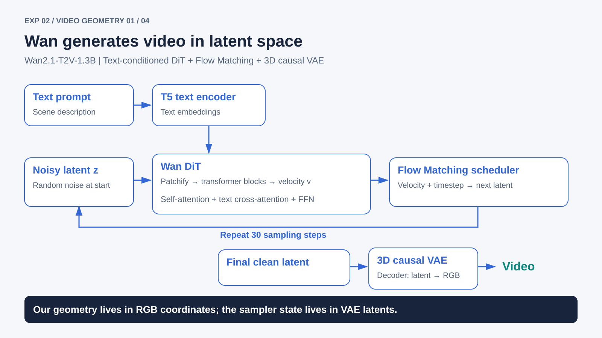
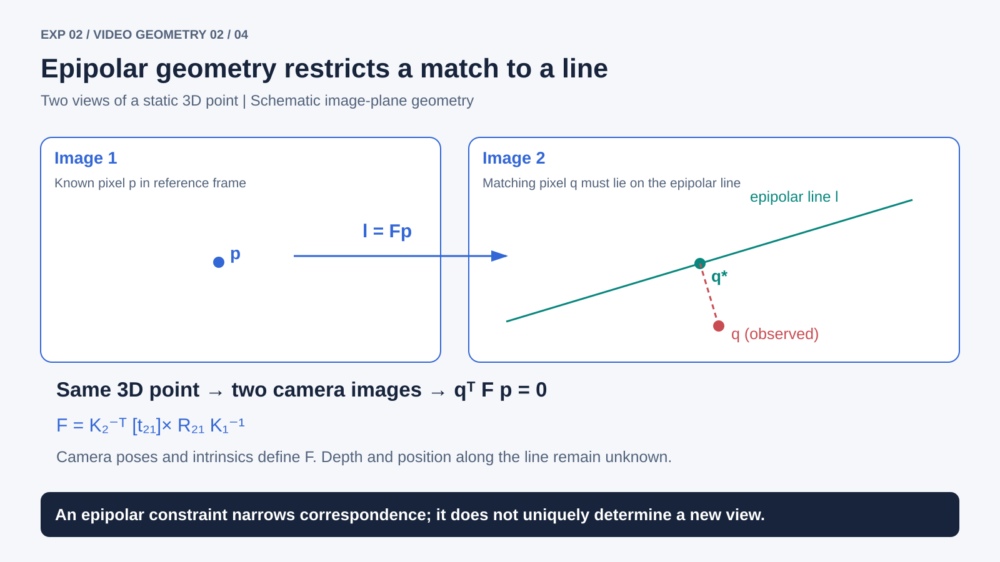
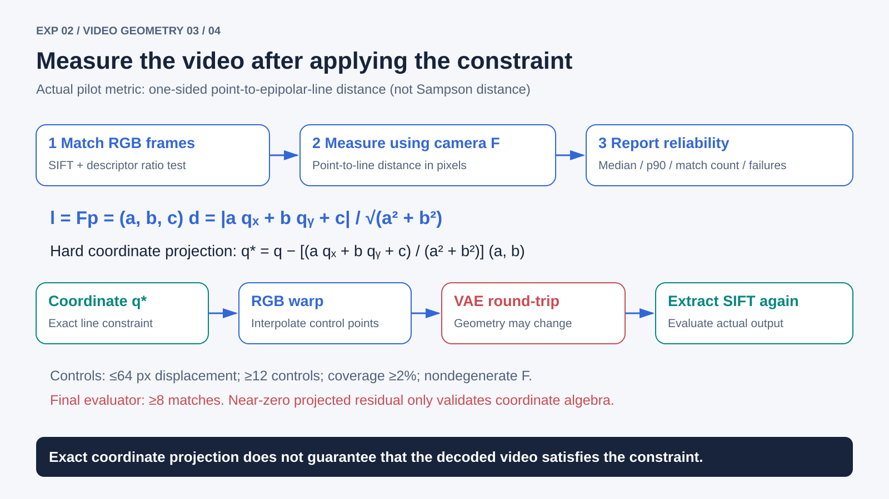
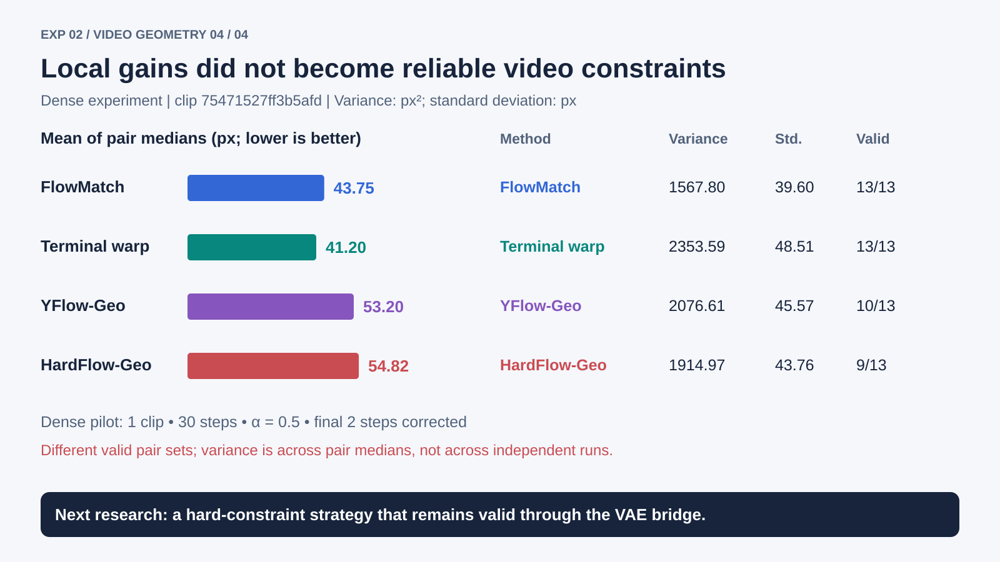

# Exp-02. Train-Free Geometric Flow Matching: 에피폴라 제약 비디오 실험

상태: **데이터 입력·대응점 제약 구현 / 생성 파이프라인 미구현** (2026-09-15). CLEVRER 기반 물리 인식·충돌 제약 계획을 종료하고, RealEstate10K의 카메라 기하를 이용한 비디오 생성 실험으로 전환한다. [Exp-02-sub](exp_02_sub_video_recognition.md)는 취소된 실험 기록으로 보존하며 선행 조건에서 제외한다.

핵심 질문은 **동결된 비디오 Flow Matching 모델의 추론에 기하 보정을 넣었을 때, 영상 품질과 대응점 검출률을 유지하면서 지정 카메라의 에피폴라 오차를 줄일 수 있는가?**이다. 대응점 공간의 hard projection을 먼저 검증하고, 영상·잠재 공간으로 전달하는 과정은 별도의 연구 가설로 검증한다. 최종 비디오의 3D consistency 또는 100% 제약 만족을 사전에 보장하지 않는다.

## 1. 채택하는 방향과 수정할 가정

정적 장면과 알려진 카메라를 사용하면 CLEVRER의 객체 ID·world 상태·충돌 인식기를 직접 학습할 필요가 없다. 다만 다음 구분이 필요하다.

| 제안 | 이번 계획의 판단 |
| :--- | :--- |
| RealEstate10K의 카메라로 F 계산 | 채택. 제공 포즈를 기준값으로 사용하되 실제 영상에서 오차와 퇴화를 검증 |
| Wan 잠재 속도를 에피폴라 선에 직접 사영 | 불가. 잠재 채널 변화율은 2D optical flow가 아니며 차원과 의미가 다름 |
| 2D 대응점/변위에 닫힌 형태 투영 | 채택. 고정된 기준점과 비퇴화 에피폴라 선에서 정확하게 정의 가능 |
| 접선 속도 투영만으로 hard constraint 달성 | 초기 제약 만족이 필요. 이미 존재하는 위치 잔차는 별도 위치 투영으로 제거 |
| 역전파 없는 O(N) 전체 파이프라인 | O(N)은 N개 대응점 투영에 한정. 매칭·VAE·warping·DiT 비용은 별도 |
| 에피폴라 만족이면 3D 일관성 확보 | 필요조건의 일부. 깊이, 양의 깊이, 다중 뷰 일관성, 외관, 실제 카메라 이동은 별도 |
| SAM 2로 정적 배경 자동 판별 | SAM 2는 분할·추적 도구. 객체의 정적/동적 여부는 별도 판정 필요 |

SAM 2는 첫 실험의 필수 의존성으로 두지 않는다. 사람이 확인한 정적 클립부터 시작하고, 필요할 때 지정 객체의 제외 마스크를 전파하는 용도로 추가한다. [SAM 2 공식 구현](https://github.com/facebookresearch/sam2)

## 2. 모델·데이터·입출력

### 2.1 백본 선택

- **첫 생성 실험:** 기존 자산을 활용하는 Wan2.1-T2V-1.3B. 텍스트 조건으로 장면을 생성하고, 생성된 첫 프레임을 대응점 기준으로 삼는 `T2V + target-camera geometry` 모드다. RealEstate10K의 첫 프레임을 native I2V 입력으로 처리하지 않는다.
- **후속 장면 조건 실험:** 첫 프레임 I₁이 필수이면 Pyramid Flow의 공식 I2V 경로를 우선 검토한다. Wan2.1의 공식 I2V 모델은 14B 계열이므로 가용 VRAM·offload 비용을 먼저 측정한다.
- 모델 변경 시 같은 백본 내부에서 baseline과 보정 방법을 다시 비교한다. T2V와 I2V 결과를 하나의 방법 효과로 합치지 않는다.

위 기능 구분은 [Wan2.1 공식 구현](https://github.com/Wan-Video/Wan2.1)과 [Pyramid Flow 공식 I2V 예제](https://github.com/jy0205/Pyramid-Flow)를 따른다. 모델 가중치는 모두 동결하며 학습·fine-tuning은 수행하지 않는다.

T2V 모드에서 데이터셋 카메라는 **목표 제어 입력**이다. 생성 장면의 실제 카메라 정답이라고 부르지 않는다. 생성 장면과 원본 장면의 픽셀 재현은 성공 기준이 아니다. I2V도 카메라 조건을 원래 받는 모델이라고 가정하지 않으며, 포즈는 외부 보정기가 사용한다.

### 2.2 RealEstate10K 구성

공식 배포는 비디오 URL, timestamp, 카메라 파라미터를 담은 텍스트 파일이며 train/test로 나뉜다. 영상 확보와 timestamp 정렬을 먼저 검증한다. 다운로드 가능한 클립 목록과 실패 목록을 고정한다. 카메라는 world-to-camera 행렬이며 intrinsics는 해상도 정규화 좌표다. [공식 데이터 형식](https://google.github.io/realestate10k/download.html)

- 개발: train에서 정적·텍스처 충분·시점 중첩이 있는 10클립. 임계값·보정 강도·시간 구간은 여기서 결정한다.
- 파일럿 평가: test에서 독립 20클립 × 3 seed. 같은 원본 URL이 개발/평가에 겹치지 않도록 검사한다.
- 확대: 파일럿 통과 후 test 100클립 × 3 seed. 소규모 FVD를 주 판정 지표로 쓰지 않는다.
- 첫 기하 실험은 2프레임 쌍, 이어서 짧은 다중 프레임으로 확장한다. 생성은 기존 33프레임·480×832를 초기 후보로 두고 공식 모델 지원 규격과 메모리 측정으로 확정한다.
- 균일 요청 시각과 실제 선택 timestamp를 함께 저장한다. 포즈가 붙은 실제 프레임을 우선 사용하고, 무기록 포즈 보간이나 단순 프레임 번호 정렬을 피한다.
- 동적 물체, 장면 전환, 큰 가림, 반복 무늬, 순수 회전·극소 baseline은 별도 표기한다. 데이터 선별은 생성 결과를 보기 전에 고정한다.

입력 manifest는 `clip_id, source_url, split, timestamps, K, R, t, spatial_transform, valid_region, prompt, seed, pair_list`를 포함한다. I2V에서만 `initial_frame`을 모델 조건에 추가한다. 원본 미래 RGB는 오라클 검증·평가 전용이며, 생성 보정기가 접근하지 않는다. 프롬프트는 첫 프레임에서 작성하고 모든 방법이 공유한다.

출력은 압축 전 `video_raw`, `video_final`, 단계별 잔차·보정량·매칭 수, 실패 사유, 실행 시간·VRAM, 모델/코드 revision·scheduler·전처리 설정이다. MP4는 시각화 산출물이다.

## 3. 기하 정의와 정확한 투영 범위

영상 프레임 번호 k, 물리적 영상 시간 s, 생성 ODE 시간 τ를 구분한다. 아래 식은 직접 유도한 구현 계약이며, [좌표계 분리 원칙](../../data/NOTICE.md)에 따라 제약을 이미지 픽셀 좌표에서 계산한다.

### 3.1 상대 포즈와 F

world-to-camera 규약 Xᵢ = RᵢXw + tᵢ에서:

$$R_{k1}=R_kR_1^\top,\qquad t_{k1}=t_k-R_{k1}t_1,$$
$$E_{k1}=[t_{k1}]_\times R_{k1},\qquad F_{k1}=K_k^{-\top}E_{k1}K_1^{-1}.$$

정규화 intrinsics를 원본 W,H로 픽셀화하고, resize/crop/padding 변환 Aᵢ를 적용해 Kᵢ′ = AᵢKᵢ로 갱신한다. 기존 F를 변환한다면 F′ = Aₖ⁻ᵀFA₁⁻¹이다. 픽셀 중심 규약도 전처리와 일치시킨다.

t=0이면 F=0이므로 에피폴라 점수를 정의하지 않는다. 순수 회전은 회전 homography KₖRₖ₁K₁⁻¹ 기반 별도 진단 대상으로 둔다. 작은 baseline의 퇴화 판정은 임의 스케일의 translation norm만으로 하지 않고 시차·매칭의 관측 가능성을 함께 본다.

### 3.2 대응점의 위치 투영: MVP의 hard constraint

기준점 p₁=(x₁,y₁,1)과 목표 프레임 추정 좌표 q=(xₖ,yₖ)를 두고:

$$l=Fp_1=(a,b,c)^\top,\quad n=(a,b)^\top,\quad r=n^\top q+c,$$
$$q^\star=q-\frac{r}{n^\top n}n.$$

이는 **p₁을 고정한 채 q만 움직이는 최소 Euclidean 거리 투영**이다. 비퇴화 선에서 nᵀq★+c=0이며, 양쪽 점을 동시에 최적화하는 Sampson 보정과는 다르다. optical flow u=q−(x₁,y₁)에 적용할 때는:

$$u^\star=u-\frac{n^\top((x_1,y_1)^\top+u)+c}{n^\top n}n.$$

분모가 작으면 invalid로 처리한다. epsilon을 더해 얻은 근사해를 exact projection이라고 부르지 않는다. 화면 밖 투영은 실패/가림으로 기록한다. 단순 clamp는 선 제약을 다시 깨뜨린다. 화면 내부까지 제약하려면 선과 유효 사각형의 교집합 선분에 투영하고, 교집합이 없으면 infeasible이다.

### 3.3 접선 투영과 latent ODE의 차이

2D 좌표가 ODE 상태이고 기준점·F가 고정된 경우에만:

$$\dot q_{\mathrm{tan}}=\dot q-\frac{n^\top\dot q}{n^\top n}n.$$

이 식은 잔차의 변화를 막지만 이미 있는 잔차를 없애지 않는다. 기준점이나 F가 바뀌면 그 미분 항도 필요하다. 우선 위치 투영을 수행하는 이산 보정으로 구현한다.

Wan 상태 z와 속도 vθ는 `[B,C,T′,H′,W′]`의 잠재 특징이다. 채널이나 프레임 차분을 임의의 2D 이동으로 간주할 수 없다. 영상 decode D와 좌표 추출 M을 거친 C(z)=C_epi(M(D(z)))에 대해 진짜 잠재 접공간 투영을 하려면, 미분 가능하고 국소 선형화가 유효하다는 가정 아래:

$$v_{\mathrm{tan}}=v-J_C^\top(J_CJ_C^\top)^\dagger J_Cv.$$

이 방식에는 Jacobian 연산이 필요하며 비선형 제약·이산 적분·매칭 교체로 인한 drift가 남는다. 학습 없음(train-free)은 입력 gradient 없음(backprop-free)과 다르다. 이 경로는 MVP에서 제외한다.

## 4. 실행 파이프라인: 투영에서 ODE까지

### 단계 A — 생성 모델 없는 기하 검증

1. 합성 3D 점과 알려진 두 카메라로 투영·상대 포즈·F·좌표 변환을 검증한다.
2. 정답 대응점에 알려진 수직/접선 잡음을 넣고 q★의 잔차·최소 이동·멱등성을 검사한다.
3. RealEstate10K 원본 쌍에서 SuperPoint+LightGlue로 대응점을 얻고 제공 F의 오차·coverage를 측정한다. 공식 [LightGlue 구현](https://github.com/cvg/LightGlue)을 사용한다.
4. 불충분한 매칭·순수 회전·잘못된 포즈 방향·crop 오류를 구분한다. 실제 데이터 오차를 바탕으로 평가 허용치를 개발 split에서 고정한다.

A에서 확인하는 hard guarantee는 **좌표 테이블에만** 적용된다. 매칭된 점 자체를 투영한 뒤 그 점으로 점수를 계산하는 결과는 수학 검산이지 영상 개선 증거가 아니다.

### 단계 B — 영상 보정의 실현 가능성

생성 전에 실제 프레임에 알려진 warp를 가한 통제 실험을 만든다. 관측 대응점 q를 q★로 이동시키는 보정장을 구성하고, 보정 영상에서 대응점을 새로 추출한다.

- 초기 구현 후보: sparse 제어점 변위의 보간 + confidence/validity mask + RGB warp. 보간 방식과 정규화 강도는 개발 split에서 고정한다.
- forward splatting(q→q★)과 inverse sampling을 구분한다. inverse grid에 forward 변위를 그대로 넣지 않는다.
- sparse 보간은 비제어점의 기하를 보장하지 않는다. 충돌하는 warp, disocclusion, hole, blur를 기록한다. 미관측 픽셀은 유효 마스크로 남기고 임의 복제를 성공으로 세지 않는다.
- 첫 프레임은 보정 기준으로 고정한다. 독립 쌍 보정은 시간적 깜빡임을 만들 수 있어 다중 프레임에서 별도 확인한다.
- 무보정, encode/decode만, warp만을 비교해 VAE 손실과 기하 보정 효과를 분리한다.

**진행 조건:** 투영 후 영상의 새 대응점에서도 오차가 줄고, coverage·선명도·hole 비율이 개발 기준을 통과해야 한다. 실패하면 ODE 연결로 확대하지 않고 표현/warp 설계를 수정한다.

### 단계 C — 동결 Flow Matching 샘플러 연결

noise-to-data τ∈[0,1]에서 Euler 속도가 vᵢ라면 종단 예측을 다음과 같이 둔다.

$$\hat z_1=z_i+(1-\tau_i)v_i.$$

신뢰도가 충분한 후반 스텝에서만 아래 보정 연산자 $Q$를 적용한다. $Q$는 latent projector가 아니다. 현재 clean 예측 $\hat z_1$를 decode하고, 첫 생성 frame을 기준으로 대응점·F·희소 RGB warp를 계산한 뒤 deterministic VAE encode와 Wan latent 정규화를 거쳐 $z_{geo}$를 돌려주는 **검증된 경우에만 정의되는 bridge**다.

```text
prompt (+ initial_frame in I2V) → frozen model → v_i
z_i + (1−τ_i)v_i → predicted clean latent
VAE decode → matching → q★ projection → RGB warp
VAE encode (deterministic posterior mean + model normalization) → z_geo
z_target = z_clean + α_i (z_geo − z_clean)
z_next = z_i + Δτ_i/(1−τ_i) × (z_target − z_i)
```

α=0이면 같은 Euler baseline과 동치여야 한다. τ=1에서 나누지 않으며 마지막 유효 스텝과 종단 보정을 명시적으로 처리한다. 모델의 실제 sigma 격자·prediction type·부호·CFG를 기준 구현에 맞춰 변환한다. 이 갱신은 **종단 예측을 영상에서 보정한 뒤 ODE에 되먹임하는 휴리스틱**이며 잠재 접공간의 정확한 직교 투영은 아니다.

매칭 불능, 과도한 warp, hole, 허용량 초과이면 해당 보정을 건너뛰고 이유를 저장한다. 초기 noisy latent에 직접 매칭하지 않는다. 게이팅 시점·빈도·α·최대 이동량은 개발 split에서 고정한다. 마지막 decode와 재매칭을 통과해야 영상 수준 성공으로 센다. encode/decode와 이후 DiT가 좌표 제약을 보존한다고 가정하지 않는다.

이 경로는 no-grad 추론으로 구성할 수 있지만 역전파가 없다는 이유만으로 저비용이라고 주장하지 않는다. 기존 Y-Flow의 PGD 알고리즘과 동일하지 않으므로 `YFlow-Geo (experimental)`로 구분하고 차이를 기록한다.

### 4.1 VAE bridge와 방법별 제약 주입

Wan latent $z$에는 픽셀 대응점의 exact constraint가 없다. 따라서 모든 방법은 다음 공통 bridge만 사용할 수 있다.

$$Q_F(z)=E\bigl(W_F(D(z))\bigr)=z_{geo},$$

여기서 $D$는 Wan VAE decode, $W_F$는 SIFT control point를 $q^\star$로 옮긴 뒤 inverse RGB warp를 적용하는 연산, $E$는 posterior `mode()`와 Wan mean/std 정규화를 포함한 deterministic encode다. $W_F$는 다음을 모두 만족할 때만 accept한다: 충분한 control point와 화면 coverage, 최대 이동량 이하, warp 뒤 **새로 찾은** 대응점의 median/p90 개선, 매칭 수·유효 면적 하한. 하나라도 실패하면 $Q_F$는 적용하지 않고 reason을 남긴다.

`Q_F`가 accept되어도 $D(Q_F(z))$의 대응점 공간에서만 국소적으로 검증된다. 이후 DiT 호출이나 다시 encode/decode한 영상이 제약을 보존한다는 보장은 없다. 그러므로 다음 방법 이름의 `-Geo` 구현은 모두 Wan 원 논문이나 Exp-01의 exact state-space 구현과 구분한다.

| 방법 | Wan에 가능한 구체적 주입 | 현재 제약으로 가능한 주장 |
| :--- | :--- | :--- |
| FlowMatch | native scheduler의 $z_{i+1}$만 사용 | 무보정 baseline |
| Terminal warp | 마지막 clean latent에만 $Q_F$를 적용하고 종료 | RGB 출력의 사후 보정; 이후 DiT가 없으므로 bridge가 통과한 pair에 한해 재매칭 개선을 주장 가능 |
| **YFlow-Geo** | $z_1^\star=(1-\alpha_i)\hat z_1+\alpha_i Q_F(\hat z_1)$, $z_{i+1}=z_i+\Delta\tau_i(z_1^\star-z_i)/(1-\tau_i)$ | 후반 terminal target feedback 휴리스틱. 가장 먼저 구현할 방법 |
| **HardFlow-Geo** | HardFlow의 terminal PGD 대신 $\bar z_1$에 $Q_F$를 한 번 적용해 $z_1^\star$를 만들고, 기존 posterior reparameterization으로 다음 state를 계산 | PGD/`BaseConstraint` hard guarantee 없음. terminal-target replacement ablation으로만 보고 |
| **SafeFlow-Geo** | clean target 차이 $g_i=(Q_F(\hat z_1)-\hat z_1)/(1-\tau_i)$를 clip·gate한 보정 속도로 더하는 heuristic | CBF-QP SafeFlow가 아님. $h(z)$와 $\nabla_z h$가 없으므로 certificate/safety claim 불가 |
| **UniConFlow-Geo** | 같은 $g_i$를 prescribed-time schedule로 가중하거나 마지막에 $Q_F$ 적용 | PTZF/QP UniConFlow가 아님. Jacobian 없이 zeroing certificate 불가 |
| **GuideFlow-Geo** | 별도 guide network를 학습하지 않고, truncation 시점에 한 번 $Q_F$ target으로 교체하거나 $g_i$를 주입 | 원 GuideFlow의 conditional/energy model이 아니다. 10개 개발 clip으로 guide 학습 금지 |

HardFlow와 YFlow에서 질문한 “decode → warp → encode 결과로 $x_{i+1}$을 정할 수 있는가”의 답은 **가능하지만 terminal clean prediction에만**이다. noisy $z_i$ 자체를 decode해 보정하거나, RGB warp 결과를 $z_i$에 더하면 scheduler의 상태 의미와 VAE temporal contract를 잃는다. $\hat z_1$ 또는 HardFlow의 $\bar z_1$을 $Q_F$에 넣고, 위 표의 rectified-flow 보간으로 다음 state를 계산한다. $\tau=1$에서는 나누지 않고 final terminal warp만 수행한다.

현재 대응점 matcher는 비미분·매 step 비용이 크다. 따라서 첫 구현은 $\tau\ge t_{on}$의 드문 step(예: 마지막 2--4회)에서만 $Q_F$를 호출한다. 중간 step에는 $\alpha_i<1$을 쓰되, 마지막 step에서 bridge가 accept되면 $\alpha_i=1$로 terminal target을 완전히 교체한다. 그렇지 않으면 final DiT step이 중간 RGB/VAE 보정을 지워 버릴 수 있다. 같은 seed에서 $\alpha=0$이 native scheduler와 bitwise 또는 허용오차 수준으로 동치인지 검사한다. `Q_F`의 SIFT 결과로 방법을 선택한 뒤 같은 SIFT 수치만 최종 보고하면 selection bias가 생기므로, 최종 평가는 고정된 별도 matcher/육안 검토로 교차 확인한다.

#### SafeFlow·UniConFlow·GuideFlow의 bridge 한계와 Lipschitz

현재 bridge에는 SafeFlow의 CBF-QP와 UniConFlow의 PTZF-QP가 요구하는 $h(z)$, $\nabla_z h(z)$가 없다. `RealEstate10KEpipolarConstraint`는 sample별 F와 **이미 추출된 픽셀 대응점**에만 정의되며 `BaseConstraint`가 아니다. SIFT의 keypoint 선택·ratio test, warp control accept/reject, VAE encode는 모두 불연속 또는 비미분 연산이다. 따라서 finite difference Jacobian을 latent 전체에 적용하는 것은 차원·비용·matching 교체 문제 때문에 현재 실험의 제약 미분으로 사용할 수 없다. SafeFlow-Geo와 UniConFlow-Geo는 $g_i$ injection ablation까지만 가능하며 QP certificate, path-wise safety, prescribed-time convergence를 주장하지 않는다.

GuideFlow도 현재는 적용할 수 없다. conditional velocity/energy model은 camera-F·대응점 품질·warp accept 상태를 조건으로 학습해야 하지만, 10개 개발 clip은 학습 데이터가 아니며 Wan T2V에는 camera conditioning 입력도 없다. 한 번의 bridge target replacement는 GuideFlow가 아니라 `GuideFlow-Geo`라는 이름의 truncation ablation으로만 기록한다.

기존 `eval/y_flow.py`의 `estimate_lipschitz()`도 Wan 경로에서는 호출되지 않는다. 그것은 `BaseConstraint.estimate_lipschitz()`가 있는 Swiss-roll/CLEVRER state projection의 local $L_P$를 gating하는 구현이다. Wan bridge에는 우선 매 bridge call마다 $\hat L_Q=\|Q_F(z+\epsilon r)-Q_F(z)\|_2/\epsilon$와 accept-set 변화율을 **경험적 sensitivity 지표**로 로그한다. 이는 SIFT/warp gate가 불연속이므로 Lipschitz 상수나 안정성 보장이 아니며, threshold는 실험적으로 skip gate에만 쓴다.

## 5. 비교와 평가

주 비교는 **FlowMatch, terminal warp, YFlow-Geo**다. HardFlow-Geo는 terminal-target replacement ablation으로 추가한다. SafeFlow/UniConFlow/GuideFlow는 미분 가능한 latent geometry surrogate가 구현되기 전에는 같은 이름의 정식 비교 방법으로 보고하지 않는다.

| 실행 | 목적 |
| :--- | :--- |
| FlowMatch | 동일 백본·조건·seed·Euler 격자의 무보정 기준선 |
| FlowMatch + terminal warp | 최종 영상 후처리만의 효과 |
| FlowMatch + VAE round-trip | 동일 횟수 encode/decode가 주는 영향 |
| YFlow-Geo | 후반 종단 보정을 ODE에 주입 |
| HardFlow-Geo | HardFlow식 다음-state reparameterization에서 terminal target만 $Q_F$로 교체 |
| SafeFlow-Geo / UniConFlow-Geo / GuideFlow-Geo | $g_i$ injection ablation; certificate·학습 방법의 원 주장과 분리 |

같은 최초 노이즈·프롬프트·해상도·프레임 수·CFG를 공유한다. DiT 호출 수와 전체 시간은 별도로 보고한다. 모든 `-Geo` 방법은 $Q_F$ 호출 step, accept/skip 사유, control coverage, RGB warp 전후 새 matcher 지표를 함께 기록한다.

### 5.1 Sampson 거리와 실패 처리

최종 영상에서 **새로 추출한** 동차 대응점 p₁,pₖ에 대해:

$$d_S=\frac{(p_k^\top Fp_1)^2}{(Fp_1)_x^2+(Fp_1)_y^2+(F^\top p_k)_x^2+(F^\top p_k)_y^2}.$$

픽셀 좌표 기준 dS는 px², √dS는 px로 표기한다. 매칭에 사용한 해상도가 다르면 좌표와 F를 평가 해상도로 맞춘다. 0에 가까운 분모는 invalid다.

- 주 지표: 클립별 √dS median/p90, 고정 허용치 내 비율, 유효 프레임 쌍 비율, 공간 grid coverage, 대응점 수.
- 인접 쌍과 첫 프레임→후속 프레임 쌍을 사전에 정하고 별도 보고한다. 공유 가시성이 없는 장거리 쌍도 사유를 저장한다.
- 목표 F의 잔차로 outlier를 제거한 후 같은 F의 성능을 재는 순환 평가를 금지한다. descriptor confidence·상호 매칭·사전 마스크로 필터를 고정하고, 기하 필터를 추가한 결과는 보조 지표로만 분리한다.
- 투영기를 평가기로 재사용한 편향을 확인하기 위해 일부 결과는 [LoFTR](https://github.com/zju3dv/LoFTR) 등 별도 matcher와 시각적 대응점 검토로 교차 확인한다.
- 무매칭·coverage 부족을 0 오차로 처리하지 않는다. 전체 클립을 분모로 한 성공률과 유효 클립에서의 오차를 함께 보고한다.

### 5.2 퇴화·품질·비용

정지 영상 복제도 특정 에피폴라 기하를 만족할 수 있다. 정지 첫 프레임 반복과 잘못된 카메라 시퀀스를 음성 대조군으로 평가하여 오라클의 판별력을 먼저 확인한다. F는 translation scale과 선 위의 이동량을 결정하지 못한다.

보조 지표는 움직임 크기, 시간적 flicker, 선명도, warp hole/유효 면적, 프롬프트·장면 보존, 블라인드 육안 비교다. 충분한 시차·매칭이 있는 쌍에서만 상대 회전/이동 방향 추정, track cycle, triangulation cheirality를 진단한다. 이들 역시 완전한 3D 보장을 뜻하지 않는다. I2V에서는 첫 프레임 일치도도 별도 기록한다.

시간/클립, peak VRAM, DiT·VAE·matcher 호출 수, 단계별 소요 시간, 보정 skip 비율을 보고한다. 통계는 클립 단위로 집계하고 같은 클립의 seed를 묶어 paired bootstrap을 사용한다. 성공은 오차 감소와 사전 고정한 coverage·품질 하한을 함께 만족하는 것으로 정의한다.

## 6. 구현 순서와 종료 기준

| 순서 | 산출물 | 다음 단계 진행 조건 |
| :--- | :--- | :--- |
| 1 | 카메라 parser, F/투영 유틸, 합성 검증 | 포즈 방향·좌표 변환·퇴화 처리와 투영 잔차 검증 |
| 2 | 개발 10클립 원본 영상 오라클 리포트 | 유효 매칭 확보, 음성 대조군과 구분 가능 |
| 3 | 통제 warp·재매칭·VAE round-trip 리포트 | 좌표 개선이 영상 개선으로 전달됨. 현재 1개 생성 clip에서 0→1은 16.81→0.29 px, 0→2는 33.71→3.79 px로 개선됐고, 0→3은 악화·장거리 쌍은 control 부족으로 skip됨 |
| 4 | 공식 파이프라인과 동치인 baseline 1클립 | seed/CFG/시간 부호/latent scaling 검증. 1-clip pilot에서 terminal warp는 0→1/2/3 residual을 16.71/33.93/49.54에서 1.45/7.83/20.09 px로 낮췄고, YFlow-Geo·HardFlow-Geo는 bridge feedback이 terminal warp보다 안정적이지 않음 |
| 5 | 후반 보정 1클립 → 개발 10클립 | 수치 안정성과 비용·품질 확인 |
| 6 | 설정 동결, test 20×3 → 100×3 | 보정 효과와 실패율을 함께 보고 |

`data/realestate10k.py`는 카메라 parser, 준비된 프레임 로더, Wan causal-VAE 입력 padding/mask, prompt/noise seed, 픽셀 대응점용 에피폴라 잔차와 투영 연산을 제공한다. `scripts/verify_realestate10k_geometry.py`는 원본/생성 MP4의 SIFT-F 잔차를, `scripts/warp_realestate10k_geometry.py`는 희소 RGB warp 뒤 새 SIFT 잔차를 기록한다. `scripts/compare_wan_geometry_methods.py`는 scheduler 내부의 `Q_F` bridge와 FlowMatch, terminal warp, YFlow-Geo, HardFlow-Geo pilot을 실행한다. 좌표 투영의 제약과 영상 재측정 오라클을 분리하며, `BaseConstraint.project_feasible`의 엄밀 보장 계약은 대응점 표현에만 적용할 수 있다. RGB/latent 보정을 동일한 exact projector로 등록하지 않는다.

현재 `configs/exp_02_video.yaml`은 CLEVRER 설정이며 `configs/realestate10k.yaml`은 개발 데이터 로더 설정이다. `model/wan.py`의 VAE helper는 Wan latent 정규화와 deterministic encode를 적용한다. Wan transformer 가중치·text conditioning/CFG·scheduler 시간과 부호를 포함한 pilot 생성 경로는 기준 pipeline과 같은 seed에서 대조했으며, 다수 clip 확장 전에는 계속 동치 검증이 필요하다.

첫 실행 목표는 **Wan 대규모 생성이 아니라 RealEstate10K 10클립에서 F 기반 평가가 작동하는지 확인하는 것**이다. 영상 보정 전달이 실패하면 결과를 명확히 남기고, 미분 가능한 latent 최적화 또는 명시적인 depth/reprojection 표현을 후속 설계로 검토한다. 그 경우 backprop-free 가정과 실험 범위를 다시 명시한다.

## 7. 최종 pilot 보고서: Wan VAE bridge의 한계

### 7.1 실험 설정

동일한 prompt, seed, Wan 2.1 T2V-1.3B, 30 denoising step에서 RealEstate10K clip `75471527ff3b5afd` 하나를 생성했다. `YFlow-Geo`와 `HardFlow-Geo`는 마지막 두 step에서만 VAE bridge를 호출했고, $\alpha=0.5$를 사용했다. dense 설정은 `control_features=8000`, ratio test `0.8`, `min_controls=12`, `support_radius=64 px`, `max_matches=2000`이다. 모든 수치는 최종 생성 MP4에서 새로 SIFT를 추출하여 계산한 F 기반 raw residual (px)이다.

표의 평균·분산은 각 방법에서 `status=ok`인 frame pair의 median residual을 0으로 대체하지 않고 집계한 표본 분산이다. 따라서 matcher 실패로 유효 pair 집합이 달라 방법 간 평균을 엄밀한 paired 비교로 해석할 수 없다. 특히 YFlow-Geo와 HardFlow-Geo의 낮은 매치 수는 좋은 결과가 아니라 실패 지표다.

| 방법 | 유효 pair / 13 | mean (px) | variance (px²) | std. (px) | median (px) |
| :--- | ---: | ---: | ---: | ---: | ---: |
| FlowMatch | 13 / 13 | 43.75 | 1567.80 | 39.60 | 16.71 |
| Terminal warp | 13 / 13 | 41.20 | 2353.59 | 48.51 | 12.59 |
| YFlow-Geo | 10 / 13 | 53.20 | 2076.61 | 45.57 | 41.08 |
| HardFlow-Geo | 9 / 13 | 54.82 | 1914.97 | 43.76 | 43.99 |

Terminal warp는 가까운 pair에서 residual median을 낮춘다. 예를 들어 0→1/2/3은 FlowMatch의 16.71/33.93/49.54 px에서 3.16/4.59/10.56 px가 되었다. 그러나 dense control은 tail을 악화시켰다. terminal warp의 동일 pair p90은 92.36/54.06/81.02 px이며, 0→4 이후 장거리 pair도 개선하지 못했다. 따라서 이 결과는 최종 RGB 보정의 **국소적 가능성**만 보이며, 영상 전체의 안정된 기하 개선은 아니다.

YFlow-Geo와 HardFlow-Geo는 terminal warp보다 일관되게 좋지 않았다. YFlow-Geo는 0→1에서 1.90 px까지 낮췄지만 0→3은 93.35 px로 악화했고 3개 pair에서 충분한 매칭을 잃었다. HardFlow-Geo도 0→1은 1.77 px였지만 0→2/3은 33.47/43.99 px이고 4개 pair가 무매칭 또는 매칭 부족이었다. 이 단일 clip에서는 YFlow-Geo가 HardFlow-Geo보다 mean과 final-step sensitivity가 조금 낮지만, 둘 다 유효 pair 감소와 큰 p90 때문에 우열을 주장할 근거가 없다.

Bridge sensitivity $\hat L_Q=\|Q_F(z+\epsilon r)-Q_F(z)\|_2/\epsilon$ ($\epsilon=0.001$)는 terminal warp에서 81.25, YFlow-Geo에서 102.71과 19.14, HardFlow-Geo에서 102.71과 33.78이었다. 이는 strict Lipschitz 상수나 certificate가 아니라 경험적 진단값이다. 다만 작은 latent perturbation이 bridge 출력에서 크게 증폭됨을 보이며, VAE bridge를 안정적인 hard projector로 취급할 수 없다는 직접적 증거다. accept된 pair 수가 같아도 대응점의 identity·warp가 같다는 뜻은 아니다.

### 7.2 실패 원인

1. **제약 공간 불일치:** exact epipolar projection은 관측된 2D 대응점 좌표에만 정의된다. Wan latent에는 대응점 좌표, camera plane, 또는 해당 제약의 닫힌 feasible set이 없다.
2. **불연속 bridge:** SIFT 검출·descriptor matching·ratio test·control accept/reject·sparse interpolation·RGB resampling·VAE encode는 미분 가능하거나 연속인 projector가 아니다. 비슷한 latent도 다른 control set과 다른 warp를 만들 수 있다.
3. **VAE round-trip 손실:** $E(W_F(D(z)))$는 pixel warp를 latent로 되돌리는 근사 변환이다. VAE의 압축, temporal receptive field, 재구성 오차가 RGB에서 맞춘 대응점을 보존하지 않으며, 이후 DiT step이 그 보정을 다시 지울 수 있다.
4. **가림과 제한된 overlap:** 더 많은 SIFT feature를 허용해도 0→4 이후에는 충분한 제어점이 생기지 않았다. 장거리 프레임의 가시 영역 차이는 detector 수를 늘려 해결되지 않는다.
5. **저신뢰 control의 확대:** dense 설정은 가까운 pair의 coverage를 약 20--31%까지 늘렸으나 p90과 결과 분산도 키웠다. 더 느슨한 matching은 제약을 강화한 것이 아니라 잘못된 warp의 자유도를 늘린 것이다.
6. **HardFlow 전제 불충족:** HardFlow의 hard projection은 모델 state 공간에서 정의된 feasible projector를 요구한다. 여기의 $Q_F$는 종단 clean prediction에 대한 사후 RGB/VAE 편집이므로, state-space hard constraint나 path-wise feasibility를 제공하지 않는다.

### 7.3 적용 가능 범위와 결론

이 VAE bridge에서는 FlowMatch baseline과 terminal warp만 직접 실행 가능한 비교이다. `YFlow-Geo`와 `HardFlow-Geo`는 terminal target을 bridge 결과로 치환한 탐색적 ablation이며, hard constraint를 Wan flow matching에 직접 적용한 구현이 아니다. 본 pilot에서 terminal warp는 일부 가까운 pair를 개선했지만, VAE bridge를 거친 feedback은 평균 오차, 분산, tail residual, 유효 매칭 수에서 baseline 또는 terminal warp를 일관되게 넘지 못했다.

SafeFlow, UniConFlow, GuideFlow는 이 실험의 VAE bridge에 **적용할 수 없다.** SafeFlow와 UniConFlow는 latent-space barrier/zeroing function 및 그 Jacobian을 사용한 QP를 요구하지만, 현재 제약은 비미분 대응점 처리 뒤에만 정의된다. GuideFlow는 camera/geometry-conditioned guide 또는 energy model의 학습을 요구하며, Wan T2V의 입력과 10개 개발 clip에는 그 조건과 학습 근거가 없다. 이들을 단순 RGB/VAE bridge injection으로 구현하면 원 방법의 safety, convergence, guidance 주장을 잃으므로 정식 baseline으로 보고하지 않는다.

따라서 다음 연구 주제는 **VAE bridge에도 적용 가능한 hard-constraint 전략의 설계**다. 후보는 (a) depth, camera, visibility를 명시적으로 표현하는 differentiable 3D reprojection latent, (b) decoder feature 또는 latent에서 학습한 연속적 correspondence/geometry surrogate와 검증된 projector, (c) warp와 VAE 재인코딩을 함께 학습하여 $D(Q(z))$의 대응점 보존을 강제하는 constrained decoder, (d) detector confidence·cycle consistency·visibility를 포함한 conservative acceptance 및 별도 평가 matcher이다. 이 전략은 먼저 synthetic camera scene과 다수 clip에서 연속성, VAE round-trip 보존, 최종 재매칭 개선을 검증한 뒤 flow matching의 hard constraint로 연결한다.

## 8. PPT 발표용 구성 — 4페이지

아래 SVG는 각각 **1600×900, 16:9** 벡터 그림이다. PowerPoint에서 `삽입 → 그림`으로 넣고 슬라이드에 맞추면 된다. 그림은 영문 표기로 구성했으며, 아래 한글 핵심 내용과 발표 멘트는 슬라이드 본문 또는 발표자 노트로 사용한다. 결과는 마지막 **dense pilot 한 클립**을 기준으로 한다.

### 1페이지 — Wan 모델: latent 공간에서 비디오 생성



**슬라이드 핵심 내용**

- 텍스트를 T5 encoder로 변환하고, DiT의 cross-attention에 조건으로 전달한다.
- DiT는 noisy video latent와 timestep을 받아 속도를 예측한다. Scheduler가 latent를 갱신하며, 본 실험은 30회 반복한다.
- 최종 latent를 3D causal VAE decoder로 RGB 영상으로 변환한다. 기본 T2V 생성에는 RGB를 다시 넣는 VAE encoder가 필요하지 않지만, 본 기하 보정 bridge에는 재인코딩이 추가된다.
- **핵심 문제: 생성 상태는 latent이고, 에피폴라 제약은 RGB에서 추출한 픽셀 좌표에 정의된다.** 본 T2V 실험에서 원본 camera pose는 모델의 직접 입력이 아니다.

**발표 멘트:** “Wan은 픽셀을 직접 갱신하지 않고 압축된 영상 latent에서 생성합니다. 우리는 최종 영상을 디코딩한 뒤에야 대응점을 찾을 수 있습니다. 따라서 기하 보정을 생성 과정에 되돌리려면 VAE encoder와 decoder를 거쳐야 합니다.”

구조 근거: [Wan 공식 구현의 모델 설명](https://github.com/Wan-Video/Wan2.1#introduction), [Wan 기술 보고서](https://arxiv.org/abs/2503.20314). 그림은 공식 그림의 복제가 아닌 본 실험용 구조 요약이다.

### 2페이지 — 에피폴라: 대응점이 위치할 수 있는 선



**슬라이드 핵심 내용**

- 동일한 정적 3D 점을 두 카메라에서 보면, 첫 영상의 점 $p$에 대응하는 두 번째 점 $q$는 에피폴라 선 $l=Fp$ 위에 있어야 한다.
- 제약식은 $q^\top Fp=0$이다. $F$는 두 카메라의 상대 pose와 intrinsics로 계산한다.
- 선 밖의 관측 대응점은 선 방향에 수직으로 이동시켜 제약을 만족시킬 수 있다.
- **선 위의 어느 위치인지와 depth는 결정되지 않는다.** 에피폴라 만족만으로 정확한 novel view 또는 완전한 3D 일관성을 증명할 수 없다.

**발표 멘트:** “첫 번째 영상에서 점 하나를 정하면 두 번째 영상에서는 대응점을 화면 전체가 아니라 특정 선 위에서 찾아야 합니다. 우리는 원본 카메라 정보로 이 선을 계산하고, 생성 영상의 대응점이 얼마나 벗어났는지 측정합니다.”

### 3페이지 — 측정과 제약: 좌표 투영 후 영상 재검증



**슬라이드 핵심 내용**

- 최종 MP4에서 SIFT 대응점을 새로 추출하고, 원본 camera $F$에 대한 **한쪽 점-선 거리**를 계산한다. 실제 pilot 값은 앞 절의 계획 지표인 Sampson 거리가 아니다.
- $l=Fp=(a,b,c)^\top$일 때 $d=|a q_x+b q_y+c|/\sqrt{a^2+b^2}$ (px). Pair별 median, p90, 매치 수, 매칭 부족 여부를 함께 기록한다.
- 좌표 투영은 $q^\star=q-\frac{a q_x+b q_y+c}{a^2+b^2}(a,b)^\top$. 비퇴화 선에서 좌표 잔차는 약 $10^{-14}$ px지만, 이 값은 **좌표 연산 검산**이다.
- 투영 변위를 RGB warp로 옮긴 뒤 VAE 재인코딩·디코딩과 최종 영상 재매칭을 거쳐야 실제 영상 개선을 확인할 수 있다.

**실제 실행 조건:** dense 보정은 SIFT feature 8000개, ratio 0.8, 최대 매치 2000개, 제어점 최소 12개, 최대 변위 64 px, support radius 64 px, coverage 최소 2%를 사용했다. Bridge는 보정 뒤 매치 최소 12개와 median 개선을 요구한다. **현재 accept gate는 p90 개선을 요구하지 않는다.** 최종 evaluator는 별도로 SIFT feature 4000개·ratio 0.75·매치 최소 8개를 사용한다. 따라서 bridge의 `min_matches=12`와 최종 평가의 유효 판정은 다르다.

**발표 멘트:** “대응점을 선 위로 옮기면 수학적으로 잔차는 거의 0입니다. 그러나 그 점을 따라 영상을 warp하고 VAE를 통과시키면 대응점이 달라질 수 있습니다. 그래서 투영한 좌표가 아니라 최종 영상에서 다시 찾은 대응점으로 평가했습니다.”

### 4페이지 — 방법별 결과와 다음 연구



**방법 비교**

| 방법 | 보정 적용 위치 | 평균 ± 표준편차 (px) | 표본분산 (px²) | 매칭 부족 pair |
| :--- | :--- | ---: | ---: | ---: |
| FlowMatch | 무보정 baseline | 43.75 ± 39.60 | 1567.80 | 0/13 (0%) |
| Terminal warp | 최종 clean latent → RGB warp → VAE 재인코딩 | 41.20 ± 48.51 | 2353.59 | 0/13 (0%) |
| YFlow-Geo | 후반 종단 예측 보정을 다음 생성 상태에 반영 | 53.20 ± 45.57 | 2076.61 | 3/13 (23.1%) |
| HardFlow-Geo | 보정한 종단 target으로 다음 상태 재구성 | 54.82 ± 43.76 | 1914.97 | 4/13 (30.8%) |

**통계 해석:** 각 유효 pair의 `raw_median_px`를 동일 가중치로 집계했다. 표준편차·표본분산은 **한 클립 내부 pair 간 변동**이며, 독립 실행 간 분산이나 신뢰구간이 아니다. Pair가 프레임을 공유하고 방법별 누락 집합도 달라 평균만으로 순위를 확정할 수 없다. 매칭 부족률은 기하 제약 위반율과도 구분한다.

**슬라이드 결론**

- Terminal warp는 가까운 pair에서 개선됐지만 전체 평균 개선은 작고 tail 오차가 남았다. YFlow-Geo와 HardFlow-Geo의 일관된 우월성은 확인하지 못했다.
- 실패 원인 후보는 sparse matching·gate의 불연속, 보정 범위 부족, VAE 재구성 손실, 후속 생성 단계의 변화다. 이 pilot만으로 VAE가 단독 원인이라고 확정할 수는 없다.
- SafeFlow·UniConFlow·GuideFlow는 **현재 비미분 bridge와 기존 구현 조건에서 원 방법 그대로 적용할 수 없어 비교에서 제외**했다. 모든 VAE 기반 설계에서 원천적으로 불가능하다는 의미는 아니다.
- **다음 연구: VAE bridge를 통과한 최종 영상에서도 제약을 유지하는 hard-constraint 전략을 설계한다.**

**발표 멘트:** “좌표 수준의 정확한 제약은 만들었지만, 생성 영상까지 그 보장이 전달되지는 않았습니다. 이번 실험은 특정 방법의 승리를 보인 결과라기보다, latent와 RGB 사이의 제약 보존 문제를 드러낸 pilot입니다. 다음 연구에서는 VAE를 통과한 뒤에도 검증 가능한 제약을 유지하는 방법을 찾겠습니다.”

## 9. Dense pilot 결과 요약표

제공된 `outputs/realestate10k_geo_dense` 결과 JSON의 최종 영상 `geometry`를 집계했다. 평가 대상은 RealEstate10K clip `75471527ff3b5afd` 하나이며, 첫 프레임 기준 7쌍과 인접 프레임 6쌍으로 총 13쌍이다. Wan2.1-T2V-1.3B, 30 steps, CFG 5.0, 보정 강도 0.5, 후반 보정 2 steps 설정을 사용했다.

↑는 클수록, ↓는 작을수록 좋은 지표이며, 각 열의 가장 좋은 관측값은 **굵게** 표시했다(동률 포함). `None`은 현재 bridge에서 해당 원 방법을 적용하지 않아 결과가 없음을 뜻한다.

| Method | Valid pairs ↑ | Mean epipolar error (px) ↓ | Std. (px) ↓ | Sample variance (px²) ↓ | Mean pair p90 (px) ↓ | Mean matches / pair ↑ | Matching failure rate ↓ |
| :--- | ---: | ---: | ---: | ---: | ---: | ---: | ---: |
| FlowMatch (Baseline) | **13/13** | 43.75 | **39.60** | **1567.80** | **58.18** | **30.85** | **0.0%** |
| Terminal warp | **13/13** | **41.20** | 48.51 | 2353.59 | 78.06 | 20.46 | **0.0%** |
| GuideFlow | None | None | None | None | None | None | None |
| HardFlow-Geo | 9/13 | 54.82 | 43.76 | 1914.97 | 91.26 | 11.31 | 30.8% |
| SafeFlow | None | None | None | None | None | None | None |
| UniConFlow | None | None | None | None | None | None | None |
| YFlow-Geo (Ours) | 10/13 | 53.20 | 45.57 | 2076.61 | 100.89 | 13.69 | 23.1% |

지표 정의 및 해석:

- **Valid pairs:** 최종 영상 재매칭에서 `status=ok`인 pair 수. 제약 만족 pair 수가 아니다.
- **Mean epipolar error / Std. / Sample variance:** 유효 pair별 `raw_median_px`의 동일 가중 평균, 표본 표준편차, 표본분산(`ddof=1`). 표준편차·분산의 ↓는 pair 간 오차 변동이 작다는 뜻이며, 평균 오차와 함께 해석한다. 독립 실행 간 변동이나 신뢰구간이 아니다.
- **Mean pair p90:** 유효 pair별 `raw_p90_px`의 산술평균. 모든 대응점을 합쳐 계산한 전체 p90이 아니다.
- **Mean matches / pair:** 매칭 부족 pair를 포함한 전체 13쌍의 `matches` 평균. 매칭 수가 많아도 대응점의 정확성이나 제약 만족을 보장하지 않는다.
- **Matching failure rate:** `status=insufficient_matches`인 pair 수 / 13. Epipolar 제약 위반율과 다르다. 매칭 실패 pair의 잔차를 0으로 대체하지 않았다.
- **비교 범위:** 방법별 유효 pair 집합이 다르므로 굵은 값은 관측된 열별 최선값이며, 동일 pair에서의 우월성이나 통계적 유의성을 뜻하지 않는다. HardFlow-Geo와 YFlow-Geo는 terminal target을 RGB/VAE bridge로 교체하는 실험이며 원 방법의 hard constraint 보장을 제공하지 않는다.
- **집계 제외:** `bridge_calls`의 중간 보정 결과와 `projected_max_abs_px`는 최종 영상 오차에 포함하지 않았다. 후자는 추출된 좌표를 선 위로 투영한 수학적 검산값이다.
